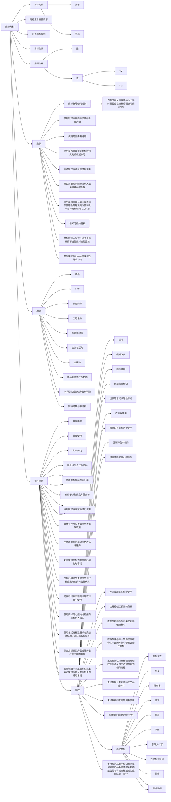
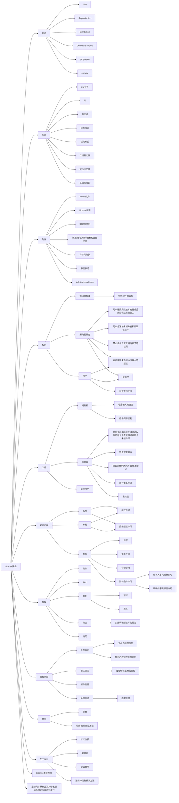

# 业务经营

## 做什么？

业务开展过程中涉及相关的法律事务。

## 场景

### 合同管理

**模板化**  

任何由我们起草的合同，都必须从公司[**模板库**](https://drive.weixin.qq.com/s?k=AEYAzAcRAA4EBTvCNI)中提取，然后进行工作内容的修改后使用。对于没有模板可用的合同场景，请驱动公司先准备模板。

维护模板的注意事项：

1. 合同中必须把购买清单与法律条款进行分离
2. 法律条款不允许随意更改，且必须集中在指定的存储地进行维护
3. 优化合同模板的时候，必须进入修订模式，留下修订痕迹和批准，待讨论通过后接收新版本
   

**命名**  

合同名称有业务名称，也有法律名称，需要根据合作方的意见共同敲定。范例：  

- 多云自动化部署框架协议
- 产学研合作框架协议书
- 云市场镜像项目合作协议

**纸质归档**  

不同类型的合同存放在不同的文件盒中，具体参考：[规范](./backoffice.md#paper)

### 第三方平台监管

- 严格遵守云平台的各种条款
- 中立看待云平台的产品，不允许给用户推荐云平台
- 云平台相关协议及时签订
- 保证金缴纳及管理
- 对口单位：平台法务、平台运营（小二）


### 商标事务

商标的目的是防止创业者或精准对手通过相近或滥用的“搭便车”行为，有其合理性。  

同时，我们需要掌握最基本的法则：  

* 商标和公司注册是两条线，相互不冲突
* 《马德里条约》用于批量向多个国家注册同一个商标（理解为商标（国家）注册团购），而不是商标互信
* TM 是TRADEMARK的缩写，并不一定是指已注册商标。而®是REGISTER的缩写，用在商标上是指已经成功注册商标的意思

#### 获取商标授权

1. 研究目标对象 License 和 商标的核心要素，并维护到对应的文档中
2. [Github](https://github.com/websoft9op/vendor/issues) 上领取或发布联系 Issue
2. 官网中寻找联系方式（法务、销售、合作伙伴、工单等频道），发送商务邮件（参考下面的范文）
3. 沟通过程关键事务会诊
4. 完成  Issue 中要求的归档等其他事务

下面是邮件范文：   

```
# 标题
Request permission to use "OpenCV" text Trademark. 

# 正文

Dear Sir or Madam,

This is Evelyn from Websoft9 which is a open source software company focus on DevOps automation.

We're a providing OpenCV automation deployment on GitHub, then we want to publish a paid product based OpenCV on Cloud Platform Marketplace（e.g AWS, Azure）like below

【Product name】：Machine vision runtime based on OpenCV
【Intellectual Property Statement in Product Overview】：The stack of this offer includes a wide range copies of open source and free software, but the Copyrights, Patents and Trademarks are legal protections for original owner.

● “OpenCV” is a trademark of Open CV and is protected by United States trademark law
● OpenCV is licensed under the Apache License Version 2.0.

We have read the Open CV's trademark policy and term, we know that in any manner likely to cause confusion among consumers or in any manner that disparages or discredits Open CV are not allowed. 

Websoft9 is a compliance company, we highly respect any of your intellectual property policies. I'd appreciate it if you could give clear reply about whether it's permissible to use your trademark above?  or other manners you think are allowed.

Thanks a lot in advance!

Best regards,

# 未回复邮件提醒

Hi Kenneth,
How are you? Hope everything is ok with you all along.

It has been a while since we start a consultation on 10, Aug. It is about license and ERPNext trademark use.
I guess things must have been hectic on your end, so I will just be brief. 
I'd recap our consultation.
1) We integrate ERPNext with other software required to run, like Ngnix and MariaDB, and automate the deployment for the integration. This integration solution is available as an open source project on GitHub. 
2）We also distribute image of the integration on platforms, like AWS, to offer one-click, pre-configured install solution for ERPNext to users. This is offered for a fee.
3) We use "ERPNext" to describe the solution, and name it as "ERPNext on Ubuntu"
We would appreciate it if you could give clear reply on whether it is permissible to do that. If what we have done is not in line with GPLv3 license and your trademark policy, do not hesitate to point out. We would correct it asap. 
More details could be found in the former discussion I added to the end.
Thanks a lot in advance.

Best regards,
Evelyn
```

#### 被投诉处理

一旦被投诉之后，需在 2 小时内给与积极的响应，接下来集体研究投诉的处理办法

下面是被投诉之后的回复邮件范文：  

```
Hi Dylan


Thank you for email, we have read Haproxy trademark policy and we have found that we have an inappropriate use.
First, we apologize for this matter, we highly respect your IP, we want to correct it until compliance as soon as possible.

We want to change product name to Software Load Balancer  which not include any HAProxy trademark, 
How do you think about this? or can you give me some suitable suggestion?

Look forward you reply

best regards,
```

#### 被侵权处理

我的知识产权被侵犯，可以侵权发生的平台投诉。涉及到更复杂的问题，可以联系外包律师团队。


### 开源 License

快速理解开源软件许可一些关键点：

* 开源许可不是法律规定，而更类似于合同条款，是在公益组织下约定成俗的一些规则
* 开源许可之间可能有冲突，导致使用多个软件作为组件之后，难以发布自身合规的开源许可


## IP 解读导图

- 内部知识产权体系建立，让知识产权成为竞争壁垒和经济杠杆
- 尊重他人的知识产权
- 实现开源代码和商标的合规使用（[Vendor repository](https://github.com/websoft9op/vendor/issues)）

### 商标

分析任何一个商标，有两个主要事项：

* 查重：[WIPO Globl Brand Database 全球商标查询数据库](https://www3.wipo.int/branddb/en)  
* 内部研究归档至：[商品解读清单](https://github.com/Websoft9/handbook/blob/main/docs/legal/_file/商标解读清单.md)  




### License

License 解读过程中，涉及的材料包括：

* 全球主流开源许可汇总数据库：https://opensource.org/licenses/alphabetical  
* 内部研究归档至：[License 解读清单](https://github.com/Websoft9/handbook/blob/main/docs/legal/_file/License解读清单.md)  




