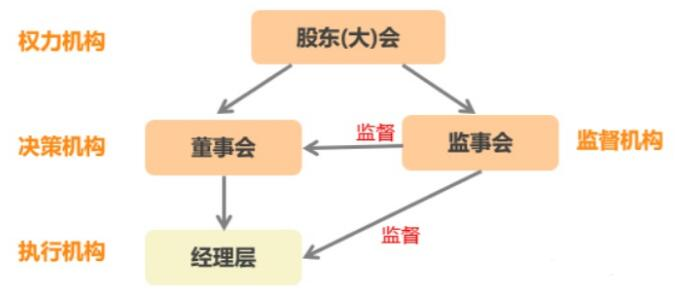

# 公司治理

## 基本法

更新时间：2023-01

基本法是公司经营和管理活动的最高行为准则，公可基本法主要是指导公可发展、管理标准、员工行为的标准，具体如下：

```
1. 公司愿景是成为一个全球化的公司，对应的产品和服务能力需要具备能够支撑全球化发展
2. 公司内员工平等，员工数量低于15之前不设立非一线管理岗位（除总经理之外）
3. “以客户需求为中心”是公司发展的航标，全员需通过各种方式参与客户沟通
4. 不允许的夫妻员工，全员遵循（包括创始人）
5. 构建自主知识产权的研发体系，形成核心竟争力
6. 爱祖国、爱人民、爱事业和生活，是我们积极工作的源动力
7. 我们的目标是以优异的产品、可靠的质量、长期有效的服务、专业的知识资讯传递，满足顾客日益增长的需要
8. 不刻意绑定生态圈，不依赖外部资本，做一个独立自主发展的企业
9. 产品，服务和知识库是公司的三大业务要素，一切工作都必项丰富或完善三大要素
```

## 治理结构

公司治理结构，指为实现公司最佳经营业绩，公司所有权与经营权基于信托责任而形成相互制衡关系的结构性制度安排。

### 治理架构



* 股东大会由全体股东组成，是公司的最高权力机构和最高决策机构。
* 董事会是股东大会授权的决策机构，由股东大会选举产生，对股东大会负责，是股东大会闭幕期间公司的常设机构。
* 监事会是股东大会授权的监督结构
* 经理层是公司由董事会聘任，在授权范围内，代表公司从事业务活动的高级管理人员（CXO）
* CEO 是企业经营的管理者，负责日常经营的全部事物。可由创始人担任，也可以外聘职业经理人


### 5C 股权结构

| 名称            | 解释        | 股权范围    | 期权范围    | 权利诉求               |
| --------------- | ----------- | ------- | ------- | ------------------ |
| Founder/Creator | 主创始人    | > 50%   |         | 控制权             |
| Co-Founder      | 联合创始人  | 10%-40% |         | 话语权、决策权     |
| Co-Partner      | 合伙人      | 5%-10%  |         | 身份认同感、参议权 |
| Co-Worker       | 骨干        |         | 10%-20% | 分红权、分利权     |
| Capital         | 投资人/机构 | 5%-20%  |         | 优先清算权、优先认购权     |

* 股权是法律上的所有权，期权是特定时间区间的所有权
* 期权池由全体股东按公司章程中约定的稀释规则进行补充
* 期权会根据工作时间逐渐派发，员工离职后会根据股价在12个月内进行回收

### 轮值 CEO

公司 CEO 可由创始人或联合创始人轮流承担。  任期为一年，期满后由股东大会决定继任或更换。  

