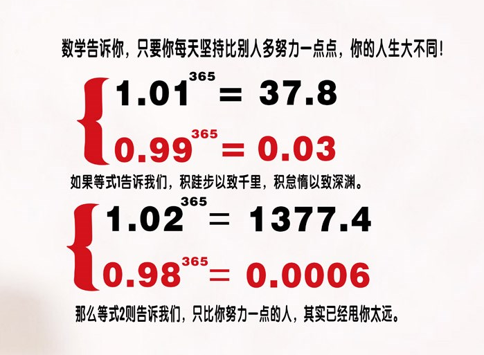
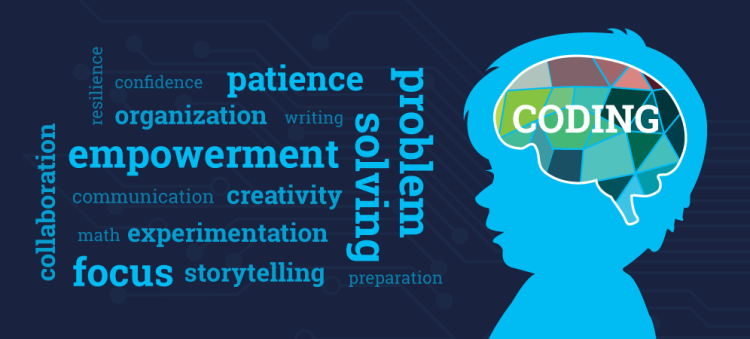

# 企业文化

## 是什么？

[文化](https://www.zhihu.com/question/19762179)与[文明](https://baike.baidu.com/item/四个文明/7812158)不同，文化=群体的集团人格。

企业文化是企业价值观的延伸，包含两个层面：

* 制度文化（成文的规定）：企业运作过程中积累的各种管理制度、纪律、规定和流程等。
* 精神文化（不成文的规定）：包括价值观、群体意识、优良传统等企业软文化，是企业文化的核心，也被称为企业精神

制度与精神互为辩证关系：

* 制度完美，若没有健康的企业精神，那就是一堆空文。  
* 企业精神完美，但没有通过制度和流程贯穿到企业运营中，那也是空想的精神。

## 标语

企业文化标语是指一些凝聚企业文化的短语，这些标语通常会对企业员工起到警醒、感召的作用。每打造自己的企业文化标语，让员工切实地感受良好的企业文化。  

```
不忘初心，方得始终
相信伙伴，开创未来
```

## 企业精神 12 条

### 格局：整体大于局部，现实立足长远

* 皮之不存，毛将焉附
* 人无远虑，必有近忧

### 专注：聚焦关键目标，自然水到渠成

* 守少则固，力专则强
* 用志不分，乃凝于神
* 惟精惟一 精纯专一
* 精诚所至，金石为开

### 成长：持续迭代复盘，量变引发质变

坚韧不拔的“平凡人（小微企业）”干出不平凡的业绩，靠什么？靠得就是持续迭代，[反复向同一个城墙冲锋](https://www.sohu.com/a/74663998_115362)。

愚公移山，[一万小时定律](https://baike.baidu.com/item/一万小时定律/8255848)讲述的都是同一个类型的故事。  



### 学习：获得他人智慧，保持知行合一

获得智者的认知有很多渠道，其中读书是一种高效的方式。  
知行合一即“只有行动了，才说明有认知”。没有行动，即表示不认可或没搞懂。

### 沟通：建立畅通渠道，传递精准信息

人与人，人与组织，组织与组织的沟通与技术组件的通信存在同样的哲学，即：

1. 找到正确的沟通对象，了解其沟通习惯、权利和期望
1. 扫除信息交流的一切障碍，快速建立畅通、稳定的沟通渠道
2. 传递精准的信息，形成正向反馈机制，确保沟通双方不出现理解偏差

沟通最大的问题是：“患得患失，在意被人对自己的看法”。消除这个心魔，让**坦诚+热情**成为沟通是最佳的方法。  

### 认知：跳出局部思维，避免盲人摸象

### 攻坚：得到关键路径，最优资源出击

“化繁为简，大事化小，小事化了。”是人类朴实的工作方法。但要做到灵活运用，却需要反复训练。
任何一个值得分解的任务中，一定包含关键路径（影响工作进度的最困难）

### 代码：知识天然载体，流程高效运行

代码（Coding）是计算机语言，它的价值体现在两个方面

- 首先，代码告诉计算机需要做的事情以及每一个步骤，计算机运行了有价值的代码就可以创造价值
- 其次，代码是计算机与计算机，计算机与程序员，程序员与程序员之间传递信息、交流知识的载体

意味着，代码具有知识载体和生产创造两个方面的价值。

这种价值区别于人类任何其他的生成或学习活动。

故，我们把产品研发、产品构建，产品分发、运营实践以代码的形式表达出来，一方面可以创造看得见的收益，另外一方面可以通过信息内容成为联系起用户和伙伴，影响整个世界。



### 榜样：多说啰嗦无益，行动值得效仿

榜样的力量远大于说教。节约写在门上，还不如每天及时关灯的动作。

### 礼仪：利多无人责备，有礼即为尊重

* 将不可骄，骄则失礼，失礼则人离，人离则众叛。——诸葛亮
* 有两种和平的的暴力，那就是法律和礼貌。——歌德

恰当的礼仪的好处是显而易见，包括：

* 通过相互尊重，建立基本信任
* 礼仪即规则，常遵守礼仪也就养成了良好的规则意识
* 得体的商务穿着，精神面貌得到改善
* 让对方感觉更谦虚
* 有助于塑造个人和企业形象

### 合作：

### 本分：老老实实做事，明明白白做人

* [《OPPO本分文化》](https://zhuanlan.zhihu.com/p/515913288)


