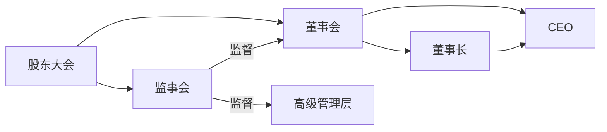

# 公司治理

## 治理结构

### 概述

权力不受约束，会阻碍和破坏公司的使命和愿景的实现。

合理的公司治理架构，确保各治理机构权责清晰、责任聚焦，但又分权制衡，使权力在闭合中循环，在循环中科学更替。

Websoft9 的治理架构有如下关键点：  

* 公司在治理层实行集体领导，不把公司的命运系于个人身上，集体领导遵循民主集中、分权制衡、自我批判的原则。
* 股东大会是公司最高权利机关，选举公司董事会、监事会，并审议董事会的重要报告
* 董事会是公司战略、经营管理最高责任机构，承担带领公司前进的使命，行使公司战略与经营管理决策权。
* 监事会是公司的最高监督机构，代表股东行使监督权。
* 经理层是公司由董事会聘任，在授权范围内，代表公司从事业务活动的高级管理人员（例如：总经理）




### 股东大会

股东会由全体股东组成，主要职责为：

- 选举产生公司董事会、监事会
- 审议董事会重要报告


### 董事会

董事会的主要职责为：

- 制订公司治理方案；
- 审议公司注册资本增加或减少方案、利润分配方案及弥补亏损方案；
- 审议公司股权激励计划、非股权的长期激励计划；
- 审议或批准公司进入或退出产业领域，批准公司战略规划；
- 批准重大的组织变革与调整、管理机制建设和业务变革；
- 批准重大的财经政策、财务规划与商业交易；
- 批准公司年度预算方案、年度经营报告及年度审计报告；
- 批准公司高级管理人员的任免、薪酬、长期激励；
- 批准公司层面的重大人力资源政策及规划；
- 批准事关公司的重大风险和重大危机的管理方案，管理重大突发事件；
- 批准内控与合规体系的建设。

### 董事长

董事长是股东利益的最高代表，是公司最高领袖，理论上讲是公司管理层所有权力的来源。  

董事长的主要职责：

1. 主持股东大会和召集、主持董事会会议；
2. 检查董事会决议的实施情况，并向董事会报告；
3. 签署公司股票、公司债券；
4. 由董事会授权董事长在董事会闭幕期间行使董事会的部分职权；
5. 提议召开临时董事会；
6. 除章程规定须由股东大会和董事会决定的事项外，董事长对公司重大业务和行政事项有权做出决定。
7. 对董事会决议的事项享有一票否决权

### CEO

首席执行官（ Chief Executive Officer，缩写CEO）是是企业经营的最高管理者，又称作总裁、总经理。

CEO 向公司的董事会负责，而且往往就是董事会的成员之一。CEO 可由创始人或联合创始人**轮流承担**。    

CEO 的主要职责：

1. 执行董事会的决议；
2. 主持公司的日常业务活动；
3. 经董事会授权，对外签订合同或处理业务；
4. 任免经理人员；
5. 定期向董事会报告业务情况，并提交年度报告。


### 监事会

监事会的定位是对公司的生存发展和命运负责，其基本职权主要体现在领袖管理、业务审视和战略前瞻三个方面。  

监事会的主要职责为：

- 对董事、高级管理人员进行考察
- 对董事候选人提名提出建议
- 对董事、高级管理人员的监督与评价
- 对公司经营和财务状况、合规与内控体系建设和运作的监督、检查与建议


### 第三方审计

每年聘用第三方审计公司对公司财务报表进行审计。  

## 重大规则

### 5C 股权结构

| 名称            | 解释        | 股权范围    | 期权范围    | 权利诉求               |
| --------------- | ----------- | ------- | ------- | ------------------ |
| Founder/Creater | 主创始人    | > 50%   |         | 控制权             |
| Co-Founder      | 联合创始人  | 10%-40% |         | 话语权、决策权     |
| Co-Partner      | 合伙人      | 5%-10%  |         | 身份认同感、参议权 |
| Co-Worker       | 骨干        |         | 10%-20% | 分红权、分利权     |
| Capital         | 投资人/机构 | 5%-20%  |         | 优先清算权、优先认购权     |

* 股权是法律上的所有权，期权是特定时间区间的所有权
* 期权池由全体股东按公司章程中约定的稀释规则进行补充
* 期权会根据工作时间逐渐派发，员工离职后会根据股价在12个月内进行回收

### 基本法

基本法是公司经营和管理活动的最高行为准则，公司基本法主要是指导公可发展、管理标准、员工行为的标准，具体如下：

```
# 更新时间：2023-01

1. 公司愿景是成为一个全球化的公司，对应的产品和服务能力需要具备能够支撑全球化发展
2. 公司内员工平等，员工数量低于15之前不设立非一线管理岗位（除总经理之外）
3. “以客户需求为中心”是公司发展的航标，全员需通过各种方式参与客户沟通
4. 不允许的夫妻员工，全员遵循（包括创始人）
5. 构建自主知识产权的研发体系，形成核心竟争力
6. 爱祖国、爱人民、爱事业和生活，是我们积极工作的源动力
7. 我们的目标是以优异的产品、可靠的质量、长期有效的服务、专业的知识资讯传递，满足顾客日益增长的需要
8. 不刻意绑定生态圈，不依赖外部资本，做一个独立自主发展的企业
9. 产品，服务和知识库是公司的三大业务要素，一切工作都必项丰富或完善三大要素
```


