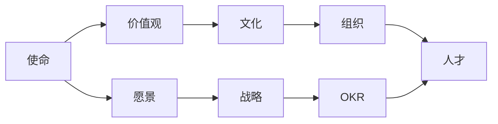

import DocCardList from '@theme/DocCardList';
import {useCurrentSidebarCategory} from '@docusaurus/theme-common';


# 企业宗旨

[使命、愿景和价值观](https://new.qq.com/rain/a/20210402A09YMN00)是企业的战略之母，也是企业的灵魂。  

一个人在遇到最困难的时候，支撑你背后的那点力量是什么？是你的“心力”，也就是你行事的初心。  

若把企业当做生命体的话，最根本的心法就是使命、愿景和价值观。

## 辩证分析

[从0到10之间的组织进化（朱一帆）](https://www.jianshu.com/p/f10c326d9f3b) 对使命与人才之间进行了辩证的分析和研究：




它揭示企业运作的战略法则，极具逻辑性和实操性：

1. 企业使命与人才之间的关系
2. 务虚与务实两条路径的辩证统一

## 指南

<DocCardList items={useCurrentSidebarCategory().items}/>

## 范例

* 阿里巴巴：[新六脉神剑](https://zhuanlan.zhihu.com/p/82023957)
* 华为：把数字世界带入每个人、每个家庭、每个组织，构建万物互联的智能世界。
* IBM：我们汇集所有必要的技术和服务，而不论这些解决方案来自何处，着力帮助客户解决最紧迫的业务问题。
* Microsoft：使命是予力全球每一人、每一组织，成就不凡。
* 凯捷：通过技术释放人类能量，实现包容和可持续的未来。
* OPPO
   ```
   使命：科技为人，以善天下
   价值观：本分、用户导向；追求极致、结果导向
   ```

