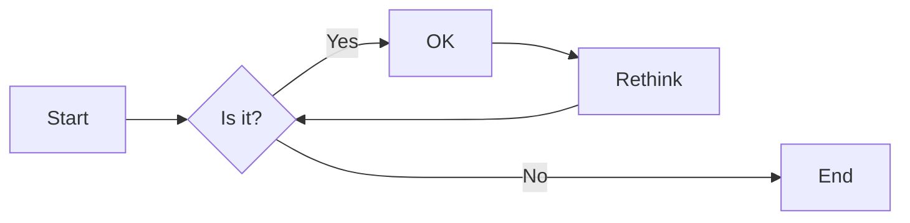
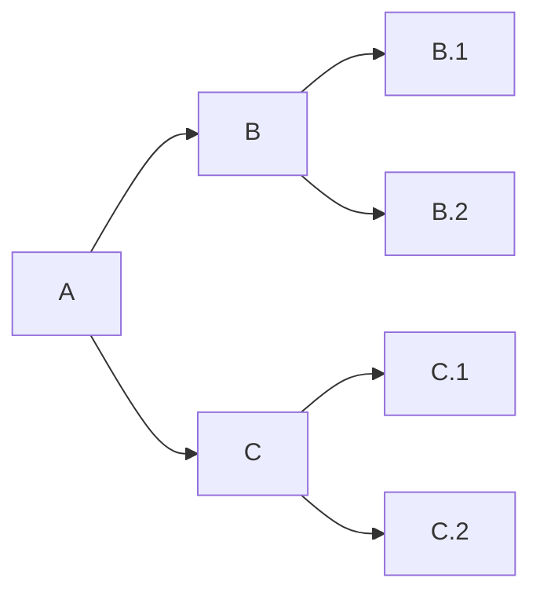
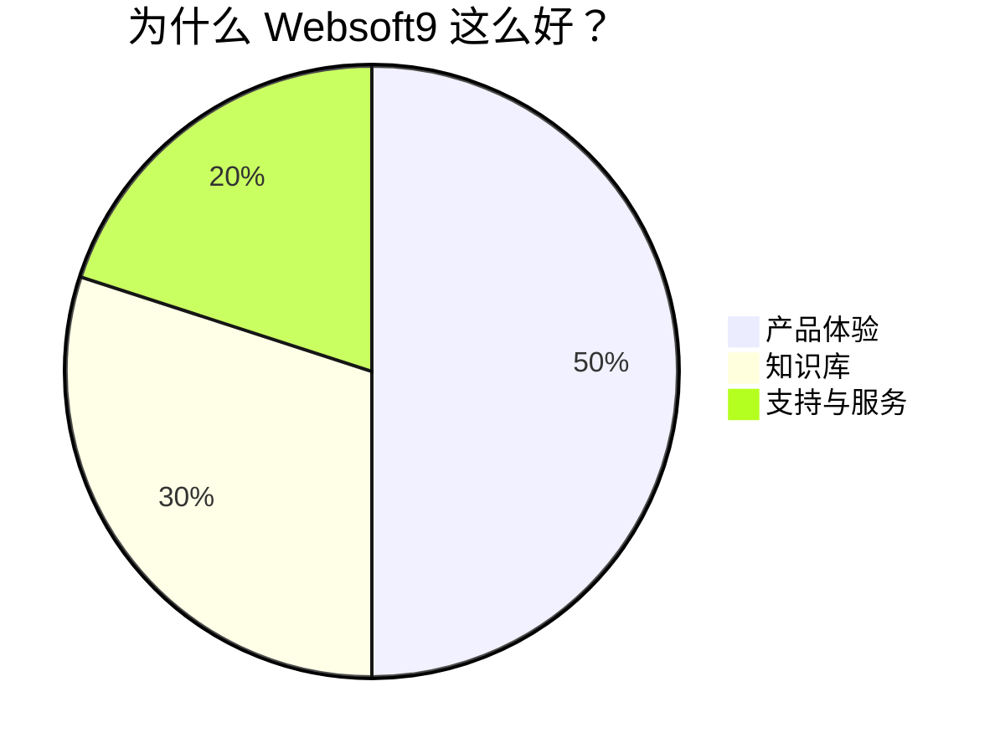

# 写作规范 

## 文档范围

* 不要做重复劳动，学会大量使用链接
* 每个主管维护自己所属的文档
* 不要有产品指南或产品说明的详情，只能是链接到对应的产品文档 
* 操作说明和指引直接插入链接，而不是拷贝粘贴内容
* 简明扼要的概括业务流程
* 重点是定义规范和总结工作哲学、方法、流程，不要把过程通过它来管理
* 客户开票信息和联系信息不允许必须存放到客户成功系统，不允许在文档中公开

本文档的表现形态主要有四种类型：

- 最佳实践总结
- 场景化的工作标准指南
- 制度与文书索引
- 工具索引

感谢所有为此文档贡献实践智慧的同学们！

## 英文礼仪

工作中会频繁使用英文，那么英文中需要注意的礼仪显得比较重要。  

```
# 感谢（开头）
Thank you for your prompt reply. 
Thank you for getting back to me.
Thank you for providing the requested information.
Thank you for all your assistance.
I truly appreciate your help in resolving the problem/ handling queries.
Thank you for feedback. ( 对方指出问题，提出建议）
Many thanks for ...

# 感谢（结尾）
Thank you for your attention to this matter.
Thank you again for everything you've done.
Thanks a lot!
Thanks for your help. 
I really appreciate it.　
I'm truly grateful for your help.　
Your help is greatly appreciated.　
Your prompt reply is much appreciated.
I'd like to express my gratitude.
Thanks a lot in advance.

# 请求帮助
I have some questions and would appreciate a lot if you could give some hints on them
I would be grateful if you 
I would appreciate if you 
I am sorry to bother you but 
I'm afraid it was a bother for you to do this.

# 确认（check）
If there is anything else wrong, please point out. 
We are always willing to take your advice. 

# 公开提问（适用论坛，Google群组等公开场合）
I would appreciate if anyone can clear my doubt or suggest proper place to ask this question.
```

## 代码定义图表

通过在 Markdown 代码块中使用 [Mermaid](https://www.yuque.com/yuqueyonghuoq8pl1/zkt9s3/bqmgeo) （[中文指南](https://www.yuque.com/yuque/gpvawt/mermaid)）来渲染图表：甘特图、思维导图、饼图、流程图、类图、状态图等。

### 方向控制

- `graph`或`graph TB`或`graph TD`：从上往下
- `graph BT`：从下往上
- `graph LR`：从左往右
- `graph RL`：从右往左

### 范例

* 流程图



* 思维导图



* 饼图



## 请求合并

文档的更新需要通过合并请求实现，即只要是合理的增删改查，都可以接受。


