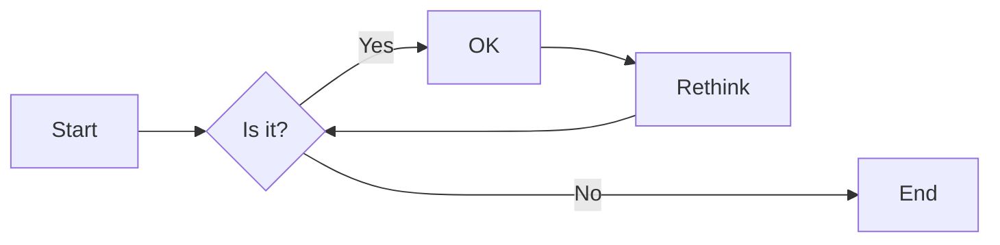
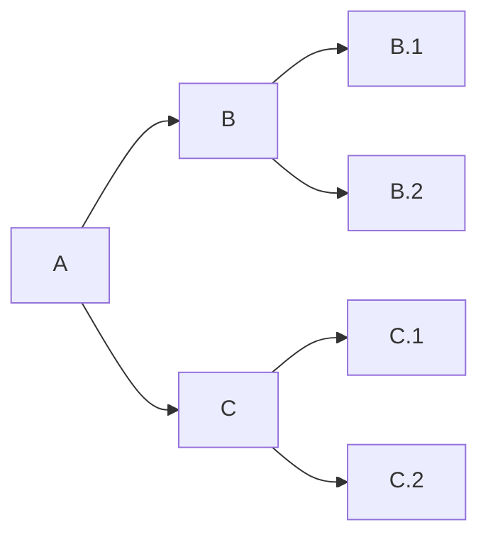
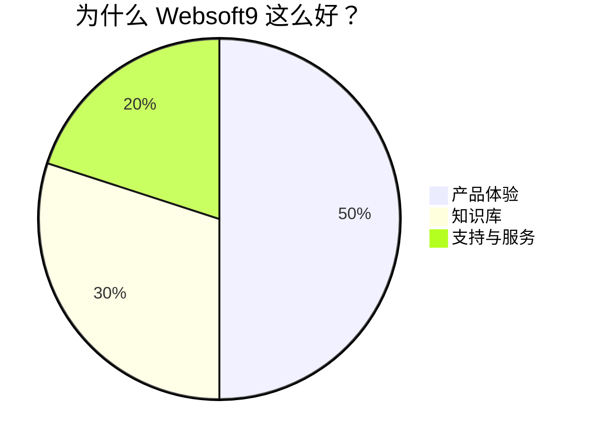

# Handbook

## 为什么？

Handbook 是我们工作中的重要组成部分，它给我们带来的好处显而易见：

* 阅读比断断续续的向别人询问快得多。
* 阅读是异步的，您不必打断某人或等待他们空闲。
* 如果外界能够看到我们的立场和我们的运作方式，人才招聘就会更容易。
* 如果人才在加入之前就知道他们正在做什么，那么保留会更好。
* 如果新人可找到详细说明的所有相关信息，则快速融入团队会更容易。
* 如果人人都可以其他部门的信息，团队合作会更容易。
* 如果当前流程已经明确描述，则对它的讨论、优化和更改会更容易。
* 每个人都可以通过合并请求提出更改来为其做出贡献。
* 沉淀企业的流程和规范
* 锻炼管理者的

如果您可以只指向差异，则传达更改会更容易。


管理是组织和指导人类各种实践活动的行为。企业管理者需要广博的知识，能够对战略做出判断，并分解具体的执行任务。同时，企业管理者又需要关注“人”这个最重要的因素，充分用好人、管好人。  

管理者如何让企业行动一致，如何让优秀人才的思想火花充分碰撞？

人类千百年实践证明，对企业**管理哲学**的不断总结和优化才是企业的制胜法宝，是企业的高效率运作的关键。

Websoft9 任何一个管理者，都必须具备卓越的写作能力，能够非常清楚的表述自己的管理哲学、工作范围、OKR 分解等核心知识。

## 好处

写作可以锻炼思维，促进成长。一个优秀并有影响力的人，必定具有卓越的写作能力。  

我们工作中不断是提升自我，还是传递信息，最佳方式莫过于提供一篇通俗易懂的文档。

优秀的企业，大部分是推崇文档文化，例如[亚马逊](https://www.justingarrison.com/blog/2021-03-15-the-document-culture-of-amazon/)。亚马逊公司有一项规定，如果要开会，必须先有会议文档，没有文档，就取消会议。会议开始后，所有人先花几分钟看文档，然后再开始讨论文档列出的问题。

优秀的军事家和政治家，很多都是文档（文章）高手，阅读《毛泽东选集》一定会被其中朴质有利的智慧所折服。

学习写文档可以参考：

* 毛泽东选集
* [How-To Geek](https://www.howtogeek.com/author/rothgar/)


## Handbook 内容范围

### 载体分工

* 官网：内容营销与品牌塑造
* 文档：产品文档以及产品周边的技术知识
* Issue：任务执行过程管理以及反馈
* Handbook：原则、标准和规范
* 微盘：机密文档以及不便于采用 HTML 渲染的内容

### 范围

* 不要做重复劳动，学会大量使用链接
* 每个主管维护自己所属的文档
* 不要有产品指南或产品说明的详情，只能是链接到对应的产品文档 
* 操作说明和指引直接插入链接，而不是拷贝粘贴内容
* 简明扼要的概括业务流程
* 重点是定义规范和总结工作哲学、方法、流程，不要把过程通过它来管理
* 客户开票信息和联系信息不允许必须存放到客户成功系统，不允许在文档中公开

### 格式

* 任何不考虑**打印输出**的文档，尽量采用 Markdown 格式编写
* 幻灯片使用  PPT 格式

本文档的表现形态主要有四种类型：

- 最佳实践总结
- 场景化的工作标准指南
- 制度与文书索引
- 工具索引

感谢所有为此文档贡献实践智慧的同学们！

## 协作

从开发团队到营销组织，每个人都需要协作关于数字内容。内容应接受大量潜在贡献者。开放贡献可以通过使用可合并的来实现 文件格式和分布式版本控制。GitLab 的使命是让每个人都可以在所有数字内容上进行协作，以便人们可以 有效合作，更快取得更好的结果。

## 知识管理

认知即资本，知识在当前的经济中越来越有价值。  

### 战略价值

无论是智力密集型行业，还是资本密集型行业，知识的创造、传播、共享和利用，都是企业保持持续竞争优势的关键。《哈佛商业评论》首先发现了知识管理的重要性，并且从不同角度对知识管理问题做了深入的探讨，并于1999年出版了由管理大师德鲁克主编的《知识管理》一书。

知识经济时代的组织更需要具有主体性、个性成熟发展的”知识型员工“。知识型员工以知识的占有为立身资本，在面对知识快速变化的大环境时，具有强烈的学习愿望，重视对知识投资的持续性，提倡终身学习。

传统的认知往往只是将企业中营销与研发相关的知识进行深度整合，形成自己的竞争力，实际上这是狭窄的。企业运作高效率需要各个部分的有机融合，所以企业必须实现全面的知识管理。

### 科学理论

管理学中经历与提升员工生产率的管理理论有两种：

* 泰勒为代表的标准化和管理控制作业理论，他将员工为“经济人”
* 德鲁克为代表的知识管理理论，他将员工为“知识人”，降低对员工的控制反而提升员工的创造能力。

知识学院派大师：德鲁克、波兰尼、野中郁次郎、卡尔.斯威比、伯克利等

知识实践派大师：马克思、列宁、毛泽东、任正非等

知识管理咨询公司：行者互联（吴庆海）

知名的著作有：《信念：冲破低迷状态，实现业绩跃迁》《创造知识的方法论》《创造知识的企业：领先企业持续创新的动力》《创造知识的实践》《创新的本质》《知识创造管理：适应未来组织发展的管理新模式》《全球知识共创》《商业模式创新实践：如何将知识转化为价值》《人类知识的原则》

知名的知识实践著作：《寻乌调研》

知识有关的奖项有：最具创新力知识型组织（MIKE）

知识有关的会议有：创新与知识管理国际会议(iKM2020)

知名的知识管理模型有：SECI模型、知识场、信念管理（MBB，区别于目标管理）

知识创造的推进模式：自上往下、自下往上、自中向上而向下

### 知识共享

知识共享依赖团队而存在，意味着知识的创造者必须充分考虑团队的属性，同理，知识的使用者也必须以团队的成员的身份理解知识，吸收知识，改进知识。知识脱离团队可以说就不存在了。

## 英文礼仪

工作中会频繁使用英文，那么英文中需要注意的礼仪显得比较重要。  

```
# 感谢（开头）
Thank you for your prompt reply. 
Thank you for getting back to me.
Thank you for providing the requested information.
Thank you for all your assistance.
I truly appreciate your help in resolving the problem/ handling queries.
Thank you for feedback. ( 对方指出问题，提出建议）
Many thanks for ...

# 感谢（结尾）
Thank you for your attention to this matter.
Thank you again for everything you've done.
Thanks a lot!
Thanks for your help. 
I really appreciate it.　
I'm truly grateful for your help.　
Your help is greatly appreciated.　
Your prompt reply is much appreciated.
I'd like to express my gratitude.
Thanks a lot in advance.

# 请求帮助
I have some questions and would appreciate a lot if you could give some hints on them
I would be grateful if you 
I would appreciate if you 
I am sorry to bother you but 
I'm afraid it was a bother for you to do this.

# 确认（check）
If there is anything else wrong, please point out. 
We are always willing to take your advice. 

# 公开提问（适用论坛，Google群组等公开场合）
I would appreciate if anyone can clear my doubt or suggest proper place to ask this question.
```

## 代码定义图表

通过在 Markdown 代码块中使用 [Mermaid](https://www.yuque.com/yuqueyonghuoq8pl1/zkt9s3/bqmgeo) （[中文指南](https://www.yuque.com/yuque/gpvawt/mermaid)）来渲染图表：甘特图、思维导图、饼图、流程图、类图、状态图等。

### 方向控制

- `graph`或`graph TB`或`graph TD`：从上往下
- `graph BT`：从下往上
- `graph LR`：从左往右
- `graph RL`：从右往左

### 范例

* 流程图

````

````

* 思维导图

````

````

* 饼图
````

````


## 请求合并

文档的更新需要通过合并请求实现，即只要是合理的增删改查，都可以接受。

## 训练

* [内容营销创造](../martech/content#createcontent)
* [活动标准化 SOW 宝典](https://www.bagevent.com/event/sales/yaacfpwdq6tqzzz3as5xlxq5qu61gmba?code=071wkmGf1u7qEu0DWbFf1dF7Gf1wkmG6&state=STATE)

