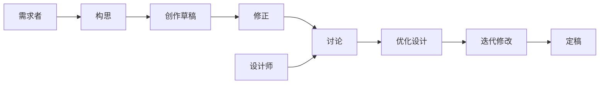

# 工程哲学

工程哲学适用于软件开发、产品管理、架构设计、用户体验设计等多个工作领域。  

## IPD

Websoft9 推崇并实践 IPD 思想：IPD（Integrated Product Development 集成产品开发）是一套以市场需求为核心，将产品开发看成一项投资，通过共享货架产品和跨部门的团队准确、快速、低成本、高质量地推出产品，是世界一流企业普遍采用的一套系统工具和策略。

集成产品开发（IPD）是区别于定制产品开发（一次性定制）和先技术再开发（闭门造车）的一种开发方案。

可以被称之集成产品开发的企业，具有如下的研发特点：

1. 产品基于市场需求，对财务成功负责
2. 技术研发和产品开发分离，异步进行
3. 有货架产品和平台产品，供开发时共享，实现快速开发、批量复制、流水线生产
4. 产品可以针对一个个细分领域，形成子产品（子版本）
5. 多产品可有组合，形成集成解决方案

### 货架
### 事业部单元

## DevOps

### 软件工程 

#### Python 之禅 

[PEP 20 – The Zen of Python](https://peps.python.org/pep-0020/)

#### 云原生 12 要素

[The Twelve-Factor App](https://12factor.net/zh_cn/)

#### 系统架构演进

[Scaling webapps for newbs & non-techies](https://arcentry.com/blog/scaling-webapps-for-newbs-and-non-techies/)

#### 面向对象设计原则

[Principles of Object-Oriented Design](http://www.cs.utsa.edu/~cs3443/notes/designPrinciples/designPrinciples.html#:~:text=Principles%20of%20Object-Oriented%20Design%201%20Single%20Responsibility%20Principle,Segregation%20Principle%20%28ISP%29%205%20Dependency%20Inversion%20Principle%20%28DIP%29)

#### 敏捷开发

敏捷实现过程会划分如下几个颗粒度：

- Task（任务）
- Millstone（里程碑）
- Release（发布版本）

多个任务=新版本，若新版本周期比较长，用户可能会焦急等待，这时候就会发布 Millstone 的中间结果。

#### 多元化团队

一个优秀的软件团队，需要各种不同类型的人才：  

* 具备商业思维和产品化思维的高层
* 具备产品化思维的产品经理
* 人际关系良好的团队粘合剂人才
* 卓越的项目解构能力的项目经理
* 单点突破的技术好手
* 指哪打哪的技术执行者
* 有耐心的重复任务执行者

#### 看板

看板是一种简单高效的工具，它适用于多人协作的任务视图

#### Issue

将问题分解成可以由个人主导完成的 Issue 是至关重要的工作哲学。

#### 文档

软件工程[文档](https://blog.prototypr.io/software-documentation-types-and-best-practices-1726ca595c7f)是一个总称，涵盖了涉及软件产品开发和使用的所有书面文档和材料。所有软件开发产品，无论是由小型团队还是大型公司创建，都需要一些相关文档。整个软件开发生命周期（SDLC）会创建不同类型的文档。存在文档来解释产品功能，统一与项目相关的信息，并允许讨论利益相关者和开发人员之间出现的所有重要问题。

文档类型众多，但抽象起来，其实就是两种类别：

- Product documentation（产品文档）：包含描述产品生命周期的需求、设计、架构、原型等开发者所需的相关的文档，另外一方面包括用户所需的操作手册、管理员手册、API手册等
- Process documentation（过程文档）：管理产品开发过程的项目计划，测试计划，报告，标准，会议记录等

产品文档中的需求文档（PRD）又是最为关键的部分，它包含用不同的角色的所需解决的问题、人机交互设计、是否符合商业目标等内容，它需要用精准的文字来描述目的、功能和行为。

编写需求文档的时候，很多人会不经意陷入技术陷阱：“谈需求的时候，牵扯实现；讲宏观的时候考虑微观”

#### 多路复用

#### 线程与进程

### 协作

#### 代码分支

项目在 Github 存在 main 和 dev 两个分支，其中 main 是主分支，dev 是开发测试分支。

* 本地同步-dev分支
* dev 分支合并到 main 分支需要人为确认

#### 两人协作工作制

在复杂任务中采用专业协作、多人分工的工作流程。

一般有两种角色：

* 需求者
* 架构师

需求者即工作的发起者、业务负责人，例如：产品经理、营销经理等。

架构师是具备专业素养的技术设计能力，两者角色配合的工作流程如下： 

最核心的原则：

1. 需求方自行在设计工具上创作一个草图，同时编写设计需求
2. 设计师在需求方的工作成果基础上进行进一步创作

#### 包管理

[30多种开发语言的包管理](http://codelani.com/posts/does-every-programming-language-have-a-central-package-repository.html)

### 测试

以下是对软件测试理论进行的结构，便于快速掌握测试技术哲学：

测试工作先要明白测试对象是什么？测试对象是对软件**组件或模块**进行**功能、性能和接口**三方面的测试。

测试对象是主线，结合下面的几个维度，最终转换成一个个具体的测试任务（通常叫做测试用例）：

* 时间：开发、上线前、上线中、维护中
* 方法：白盒、黑盒、灰盒、静态、动态、自动、手工
*  维度：函数级测试、最小单元功能级测试、场景级测试

### 设计工程

设计也是一门技术，而且是对综合知识要求极高的工程技术。 

设计技术的本质：单元化组件的组合。 技术最好由三层结构实现。  

* 单元化组件：单元化组件是可以被图片引用，并无需任何更改即可使用的设计元素。 例如 字体、颜色、矢量图标、插画、照片等
* 盒子化中间件：具有一定的“盒子化”特征，单元的设计具有整体性，不可被分割，但又比最小单元展示出更多的内涵
* 整体系统：网页、画册、场景化图片

## 架构师

### 企业架构师
### 设计架构师

如果我们准备在设计上提升能力，那么必须有一个设计架构师的角色。  

之所以称之为架构师，是因为需要这个角色能够对设计进行系统化设计，包括：

1. 设计工作整体规划
2. 设计建模
3. 业务流程规范化
4. 单元化组件制作
5. 设计工具选型
6. 设计风向与迭代

当前，我们继续解决的问题包括：

1. 设计工具选型
2. 单元化组件制作

## 参考书目

* [《计算机体系结构》](https://foxsen.github.io/archbase/) 智能时代计算机类专业教育计算机类专业系统能力培养 2.0 研究组
* [《Linux从入门到精通》](http://xue.bookln.cn/book/26867/7af466) 何明 中国水利水电出版社
* [《计算机组成原理》](https://arcentry.com/blog/scaling-webapps-for-newbs-and-non-techies/)  电子科技大学精品课程
* [测试理论基础（思维导图）](https://www.cnblogs.com/dongye95/p/9312027.html)
* [Unix 哲学基础](http://www.catb.org/~esr/writings/taoup/html/ch01s06.html)
* [CSE 代码-与工程手册（微软开发手册）](https://microsoft.github.io/code-with-engineering-playbook/)
* [Kubernetes 中文指南/云原生应用架构实战手册](https://jimmysong.io/kubernetes-handbook/)