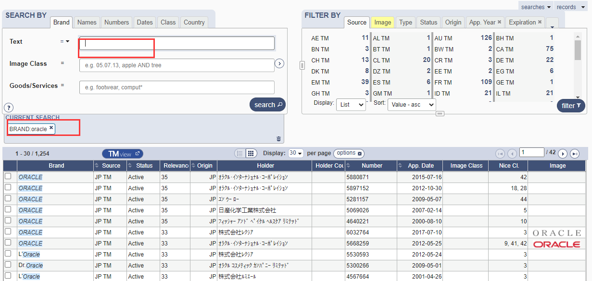
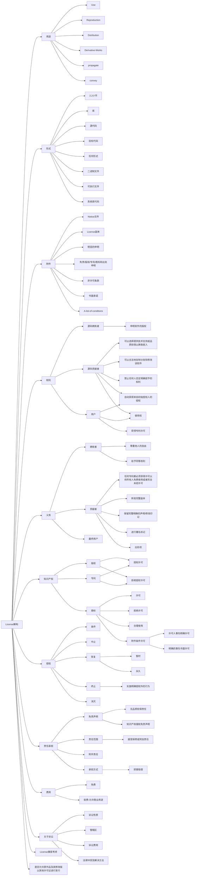
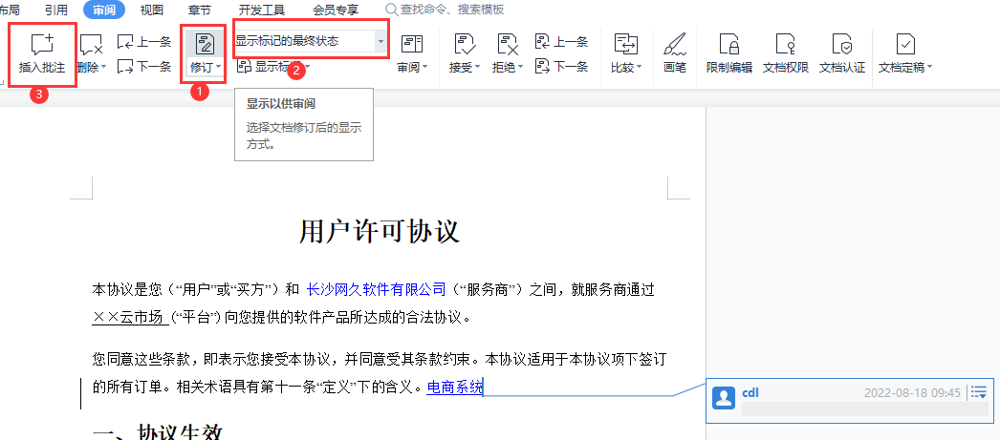

# 合规与法务

Websoft9 是一家全球化运作的企业，合规性是企业战略和发展之基石。

## 合规场景

### 财税合规

- 发票：杜绝虚假发票、杜绝虚假交易
- 税务：各种应缴纳的税收必须如实缴纳，不允许“合理避税”的做法
- 账目：公司每一笔支出都需记录来龙去脉，有据可依
- 资金：银行往来资金需有合同对应
- 外汇：外汇合规管理
- 合同：杜绝虚假合同（或夸大交付内容的合同）
- 反腐：杜绝不合法的“佣金”、“回扣贿赂”、“洗黑钱”等支出
- 对口单位：税务局、社保局、工商局、银行

### 工商合规

- 工商所要求的年报及时[上报](https://github.com/websoft9op/company/issues/90)
- 工商所关注的《广告法》极限用语零杜绝（市场监督管理局具有《广告法》违法的行政处罚权）
- 对口单位：市场监督管理局

### 用工合规

- 正式员工需要缴纳基本的社会保险，给与员工合法的权益
- 签订劳动合同以及续签
- 裁员与离职流程严谨
- 工作场所和出差安全生产
- 对口单位：社保局、税务局

### 网信合规

信息安全是国家当前重点关注的工程，企业运作中需投入相当的精力处理相关事务：

- 用户隐私保护
- 客户的数据和账号保护
- 公司的数据和账号保护
- [工信部ICP备案和公安备案](https://github.com/websoft9op/company/issues/81)及时更新
- 长沙市公安局 “星城园丁”网络安全定期报备（群防群治）
- 湖南省市场监督管理局 **网上亮照**

### 平台合规

- 严格遵守云平台的各种条款
- 中立看待云平台的产品，不允许给用户推荐云平台
- 云平台相关协议及时签订
- 保证金缴纳及管理
- 对口单位：平台法务、平台运营（小二）

## 知识产权

### 做什么？

- 内部知识产权体系建立，让知识产权成为竞争壁垒和经济杠杆
- 尊重他人的知识产权
- 实现开源代码和商标的合规使用（[Vendor repository](https://github.com/websoft9op/vendor/issues)）

### 指南

**商标授权工作指南**  

1. 研究目标对象 License 和 商标的核心要素，并维护到对应的文档中
2. [Github](https://github.com/websoft9op/vendor/issues) 上领取或发布联系 Issue
2. 官网中寻找联系方式（法务、销售、合作伙伴、工单等频道），发送商务邮件（参考范文）
3. 沟通过程关键事务会诊
4. 完成  Issue 中要求的归档等其他事务

**被投诉指南**  

一旦被投诉之后，需在 2 小时内给与积极的响应，接下来集体研究投诉的处理办法

**被侵权指南**  

我的知识产权被侵犯，可以侵权发生的平台投诉。涉及到更复杂的问题，可以联系外包律师团队。


### 商标解读

#### 基本法则

* 商标和公司注册是两条线，相互不冲突
* 《马德里条约》用于批量向多个国家注册同一个商标（理解为商标（国家）注册团购），而不是商标互信
* 商标的目的是防止创业者或精准对手通过相近或滥用的“搭便车”行为，有其合理性

#### 查重

[WIPO Globl Brand Database 全球商标查询数据库](https://www3.wipo.int/branddb/en)  



> TM是TRADEMARK的缩写，美国的商标通常加注TM，并不一定是指已注册商标。而®是REGISTER的缩写，用在商标上是指已经成功注册商标的意思

#### 思维导图

### License 解读

全球主流开源许可汇总数据库：https://opensource.org/licenses/alphabetical  

#### 基本法则

快速理解开源软件许可一些关键点：

* 开源许可不是法律规定，而更类似于合同条款，是在公益组织下约定成俗的一些规则
* 开源许可之间可能有冲突，导致使用多个软件作为组件之后，难以发布自身合规的开源许可
* 开源许可关键字：

#### 


#### 思维导图



## 人才要求

胜任 Websoft9 的法务相关工作，需要法务人具备：

* 软技能
    ```
    软件业的宏观概念
    理解软件和软件源码之间的关系
    对版权和商标相关法律清晰的认知
    目标驱动的工作理念（非技术驱动或学习成长驱动）
    沟通中的主动权
    搜寻知识的能力
    搜寻人的能力
    协调公司资源的能力
    ```

* 硬技能

    ```
    读懂每一个涉及到的License
    读懂每一个涉及到的商标
    英文读写能力
    ```

## 法务管理

我们在工作中涉及到的各种法律法规多达几十种（[参考](https://support.websoft9.com/docs/legal/zh/other-refer.html#%E6%B3%95%E5%BE%8B)），稍有不慎，将有可能造成无法挽回的损失。  

### 合同

**模板化**  

任何由我们起草的合同，都必须从公司[**模板库**](https://drive.weixin.qq.com/s?k=AEYAzAcRAA4EBTvCNI)中提取，然后进行工作内容的修改后使用。对于没有模板可用的合同场景，请驱动公司先准备模板。

维护模板的注意事项：

1. 合同中必须把购买清单与法律条款进行分离
2. 法律条款不允许随意更改，且必须集中在指定的存储地进行维护
3. 优化合同模板的时候，必须进入修订模式，留下修订痕迹和批准，待讨论通过后接收新版本
   

**命名**  

合同名称有业务名称，也有法律名称，需要根据合作方的意见共同敲定。范例：  

- 多云自动化部署框架协议
- 产学研合作框架协议书
- 云市场镜像项目合作协议

**纸质归档**  

不同类型的合同存放在不同的文件盒中，具体参考：[规范](./backoffice.md#paper)

### 法律条款速查

下面列出重要的法律条款：  

* 刑法

    ```
    第一百一十条 有下列间谍行为之一，危害国家安全的，处十年以上有期徒刑或者无期徒刑；情节较轻的，处三年以上十年以下有期徒刑：
    （一）参加间谍组织或者接受间谍组织及其代理人的任务的；
    （二）为敌人指示轰击目标的。
    第一百一十一条 为境外的机构、组织、人员窃取、刺探、收买、非法提供国家秘密或者情报的，处五年以上十年以下有期徒刑；情节特别严重的，处十年以上有期徒刑或者无期徒刑；情节较轻的，处五年以下有期徒刑、拘役、管制或者剥夺政治权利。
    第二百一十三条 未经注册商标所有人许可，在同一种商品上使用与其注册商标相同的商标，情节严重的，处三年以下有期徒刑或者拘役，并处或者单处罚金；情节特别严重的，处三年以上七年以下有期徒刑，并处罚金。
    第二百一十四条 销售明知是假冒注册商标的商品，销售金额数额较大的，处三年以下有期徒刑或者拘役，并处或者单处罚金；销售金额数额巨大的，处三年以上七年以下有期徒刑，并处罚金。
    第二百一十五条 伪造、擅自制造他人注册商标标识或者销售伪造、擅自制造的注册商标标识，情节严重的，处三年以下有期徒刑、拘役或者管制，并处或者单处罚金；情节特别严重的，处三年以上七年以下有期徒刑，并处罚金。
    第二百一十六条 假冒他人专利，情节严重的，处三年以下有期徒刑或者拘役，并处或者单处罚金。
    第二百一十七条 以营利为目的，有下列侵犯著作权情形之一，违法所得数额较大或者有其他严重情节的，处三年以下有期徒刑或者拘役，并处或者单处罚金；违法所得数额巨大或者有其他特别严重情节的，处三年以上七年以下有期徒刑，并处罚金：
    （一）未经著作权人许可，复制发行其文字作品、音乐、电影、电视、录像作品、计算机软件及其他作品的；
    （二）出版他人享有专有出版权的图书的；
    （三）未经录音录像制作者许可，复制发行其制作的录音录像的；
    （四）制作、出售假冒他人署名的美术作品的。
    第二百一十八条 以营利为目的，销售明知是本法第二百一十七条规定的侵权复制品，违法所得数额巨大的，处三年以下有期徒刑或者拘役，并处或者单处罚金。
    第二百一十九条 有下列侵犯商业秘密行为之一，给商业秘密的权利人造成重大损失的，处三年以下有期徒刑或者拘役，并处或者单处罚金；造成特别严重后果的，处三年以上七年以下有期徒刑，并处罚金：
    （一）以盗窃、利诱、胁迫或者其他不正当手段获取权利人的商业秘密的；
    （二）披露、使用或者允许他人使用以前项手段获取的权利人的商业秘密的；
    （三）违反约定或者违反权利人有关保守商业秘密的要求，披露、使用或者允许他人使用其所掌握的商业秘密的。明知或者应知前款所列行为，获取、使用或者披露他人的商业秘密的，以侵犯商业秘密论。本条所称商业秘密，是指不为公众所知悉，能为权利人带来经济利益，具有实用性并经权利人采取保密措施的技术信息和经营信息。本条所称权利人，是指商业秘密的所有人和经商业秘密所有人许可的商业秘密使用人。
    第二百二十条 单位犯本节第二百一十三条至第二百一十九条规定之罪的，对单位判处罚金，并对其直接负责的主管人员和其他直接责任人员，依照本节各该条的规定处罚。
    第二百二十一条 捏造并散布虚伪事实，损害他人的商业信誉、商品声誉，给他人造成重大损失或者有其他严重情节的，处二年以下有期徒刑或者拘役，并处或者单处罚金。
    第二百二十二条 广告主、广告经营者、广告发布者违反国家规定，利用广告对商品或者服务作虚假宣传，情节严重的，处二年以下有期徒刑或者拘役，并处或者单处罚金。
    第二百二十三条 投标人相互串通投标报价，损害招标人或者其他投标人利益，情节严重的，处三年以下有期徒刑或者拘役，并处或者单处罚金。投标人与招标人串通投标，损害国家、集体、公民的合法利益的，依照前款的规定处罚。
    第二百二十四条 有下列情形之一，以非法占有为目的，在签订、履行合同过程中，骗取对方当事人财物，数额较大的，处三年以下有期徒刑或者拘役，并处或者单处罚金；数额巨大或者有其他严重情节的，处三年以上十年以下有期徒刑，并处罚金；数额特别巨大或者有其他特别严重情节的，处十年以上有期徒刑或者无期徒刑，并处罚金或者没收财产：
    （一）以虚构的单位或者冒用他人名义签订合同的；
    （二）以伪造、变造、作废的票据或者其他虚假的产权证明作担保的；
    （三）没有实际履行能力，以先履行小额合同或者部分履行合同的方法，诱骗对方当事人继续签订和履行合同的；
    （四）收受对方当事人给付的货物、货款、预付款或者担保财产后逃匿的；
    （五）以其他方法骗取对方当事人财物的。
    第二百八十二条 以窃取、刺探、收买方法，非法获取国家秘密的，处三年以下有期徒刑、拘役、管制或者剥夺政治权利；情节严重的，处三年以上七年以下有期徒刑。非法持有属于国家绝密、机密的文件、资料或者其他物品，拒不说明来源与用途的，处三年以下有期徒刑、拘役或者管制。
    第二百八十三条 非法生产、销售窃听、窃照等专用间谍器材的，处三年以下有期徒刑、拘役或者管制。
    第二百八十四条 非法使用窃听、窃照专用器材，造成严重后果的，处二年以下有期徒刑、拘役或者管制。
    第二百八十五条 违反国家规定，侵入国家事务、国防建设、尖端科学技术领域的计算机信息系统的，处三年以下有期徒刑或者拘役。
    第二百八十六条 违反国家规定，对计算机信息系统功能进行删除、修改、增加、干扰，造成计算机信息系统不能正常运行，后果严重的，处五年以下有期徒刑或者拘役；后果特别严重的，处五年以上有期徒刑。违反国家规定，对计算机信息系统中存储、处理或者传输的数据和应用程序进行删除、修改、增加的操作，后果严重的，依照前款的规定处罚。故意制作、传播计算机病毒等破坏性程序，影响计算机系统正常运行，后果严重的，依照第一款的规定处罚。
    第二百八十七条 利用计算机实施金融诈骗、盗窃、贪污、挪用公款、窃取国家秘密或者其他犯罪的，依照本法有关规定定罪处罚。
    ```

* 民法典

    ```
    第六十二条 法定代表人因执行职务造成他人损害的，由法人承担民事责任。法人承担民事责任后，依照法律或者法人章程的规定，可以向有过错的法定代表人追偿。
    第六十三条 法人以其主要办事机构所在地为住所。依法需要办理法人登记的，应当将主要办事机构所在地登记为住所。
    第六十四条 法人存续期间登记事项发生变化的，应当依法向登记机关申请变更登记。
    第六十五条 法人的实际情况与登记的事项不一致的，不得对抗善意相对人。
    第一百一十一条 自然人的个人信息受法律保护。任何组织或者个人需要获取他人个人信息的，应当依法取得并确保信息安全，不得非法收集、使用、加工、传输他人个人信息，不得非法买卖、提供或者公开他人个人信息。
    第一百五十二条 有下列情形之一的，撤销权消灭：
    （一）当事人自知道或者应当知道撤销事由之日起一年内、重大误解的当事人自知道或者应当知道撤销事由之日起九十日内没有行使撤销权；
    （二）当事人受胁迫，自胁迫行为终止之日起一年内没有行使撤销权；
    （三）当事人知道撤销事由后明确表示或者以自己的行为表明放弃撤销权。当事人自民事法律行为发生之日起五年内没有行使撤销权的，撤销权消灭。
    第一百八十八条 向人民法院请求保护民事权利的诉讼时效期间为三年。法律另有规定的，依照其规定。诉讼时效期间自权利人知道或者应当知道权利受到损害以及义务人之日起计算。法律另有规定的，依照其规定。
    但是，自权利受到损害之日起超过二十年的，人民法院不予保护，有特殊情况的，人民法院可以根据权利人的申请决定延长。
    第一百九十二条 诉讼时效期间届满的，义务人可以提出不履行义务的抗辩。诉讼时效期间届满后，义务人同意履行的，不得以诉讼时效期间届满为由抗辩；义务人已经自愿履行的，不得请求返还。
    第一百九十三条 人民法院不得主动适用诉讼时效的规定。
    第一百九十四条 在诉讼时效期间的最后六个月内，因下列障碍，不能行使请求权的，诉讼时效中止：
    （一）不可抗力；
    （二）无民事行为能力人或者限制民事行为能力人没有法定代理人，或者法定代理人死亡、丧失民事行为能力、丧失代理权；
    （三）继承开始后未确定继承人或者遗产管理人；
    （四）权利人被义务人或者其他人控制；
    （五）其他导致权利人不能行使请求权的障碍。自中止时效的原因消除之日起满六个月，诉讼时效期间届满。
    第一百九十五条 有下列情形之一的，诉讼时效中断，从中断、有关程序终结时起，诉讼时效期间重新计算：
    （一）权利人向义务人提出履行请求；
    （二）义务人同意履行义务；
    （三）权利人提起诉讼或者申请仲裁；
    （四）与提起诉讼或者申请仲裁具有同等效力的其他情形。
    第一百九十六条 下列请求权不适用诉讼时效的规定：
    （一）请求停止侵害、排除妨碍、消除危险；
    （二）不动产物权和登记的动产物权的权利人请求返还财产；
    （三）请求支付抚养费、赡养费或者扶养费；
    （四）依法不适用诉讼时效的其他请求权。
    第三百八十六条 担保物权人在债务人不履行到期债务或者发生当事人约定的实现担保物权的情形，依法享有就担保财产优先受偿的权利，但是法律另有规定的除外。
    第三百八十七条 债权人在借贷、买卖等民事活动中，为保障实现其债权，需要担保的，可以依照本法和其他法律的规定设立担保物权。第三人为债务人向债权人提供担保的，可以要求债务人提供反担保。反担保适用本法和其他法律的规定。
    第三百八十八条 设立担保物权，应当依照本法和其他法律的规定订立担保合同。担保合同包括抵押合同、质押合同和其他具有担保功能的合同。担保合同是主债权债务合同的从合同。主债权债务合同无效的，担保合同无效，但是法律另有规定的除外。担保合同被确认无效后，债务人、担保人、债权人有过错的，应当根据其过错各自承担相应的民事责任。
    第三百八十九条 担保物权的担保范围包括主债权及其利息、违约金、损害赔偿金、保管担保财产和实现担保物权的费用。当事人另有约定的，按照其约定。
    第三百九十条 担保期间，担保财产毁损、灭失或者被征收等，担保物权人可以就获得的保险金、赔偿金或者补偿金等优先受偿。被担保债权的履行期限未届满的，也可以提存该保险金、赔偿金或者补偿金等。
    第三百九十一条 第三人提供担保，未经其书面同意，债权人允许债务人转移全部或者部分债务的，担保人不再承担相应的担保责任。
    第三百九十二条 被担保的债权既有物的担保又有人的担保的，债务人不履行到期债务或者发生当事人约定的实现担保物权的情形，债权人应当按照约定实现债权；没有约定或者约定不明确，债务人自己提供物的担保的，债权人应当先就该物的担保实现债权；第三人提供物的担保的，债权人可以就物的担保实现债权，也可以请求保证人承担保证责任。提供担保的第三人承担担保责任后，有权向债务人追偿。
    第三百九十三条 有下列情形之一的，担保物权消灭：
    （一）主债权消灭；
    （二）担保物权实现；
    （三）债权人放弃担保物权；
    （四）法律规定担保物权消灭的其他情形。
    第四百七十条 合同的内容由当事人约定，一般包括下列条款：
    （一）当事人的姓名或者名称和住所；
    （二）标的；
    （三）数量；
    （四）质量；
    （五）价款或者报酬；
    （六）履行期限、地点和方式；
    （七）违约责任；
    （八）解决争议的方法。
    当事人可以参照各类合同的示范文本订立合同。
    第四百七十一条 当事人订立合同，可以采取要约、承诺方式或者其他方式。
    第四百七十二条 要约是希望与他人订立合同的意思表示，该意思表示应当符合下列条件：
    （一）内容具体确定；
    （二）表明经受要约人承诺，要约人即受该意思表示约束。
    第四百七十三条 要约邀请是希望他人向自己发出要约的表示。拍卖公告、招标公告、招股说明书、债券募集办法、基金招募说明书、商业广告和宣传、寄送的价目表等为要约邀请。商业广告和宣传的内容符合要约条件的，构成要约。
    第四百七十四条 要约生效的时间适用本法第一百三十七条的规定。
    第四百七十五条 要约可以撤回。要约的撤回适用本法第一百四十一条的规定。
    第四百七十六条 要约可以撤销，但是有下列情形之一的除外：
    （一）要约人以确定承诺期限或者其他形式明示要约不可撤销；
    （二）受要约人有理由认为要约是不可撤销的，并已经为履行合同做了合理准备工作。
    第四百七十七条 撤销要约的意思表示以对话方式作出的，该意思表示的内容应当在受要约人作出承诺之前为受要约人所知道；撤销要约的意思表示以非对话方式作出的，应当在受要约人作出承诺之前到达受要约人。
    第四百七十八条 有下列情形之一的，要约失效：
    （一）要约被拒绝；
    （二）要约被依法撤销；
    （三）承诺期限届满，受要约人未作出承诺；
    （四）受要约人对要约的内容作出实质性变更。
    第四百七十九条 承诺是受要约人同意要约的意思表示。
    第四百八十条 承诺应当以通知的方式作出；但是，根据交易习惯或者要约表明可以通过行为作出承诺的除外。
    第四百八十一条 承诺应当在要约确定的期限内到达要约人。
    要约没有确定承诺期限的，承诺应当依照下列规定到达：
    （一）要约以对话方式作出的，应当即时作出承诺；
    （二）要约以非对话方式作出的，承诺应当在合理期限内到达。
    第四百八十二条 要约以信件或者电报作出的，承诺期限自信件载明的日期或者电报交发之日开始计算。信件未载明日期的，自投寄该信件的邮戳日期开始计算。要约以电话、传真、电子邮件等快速通讯方式作出的，承诺期限自要约到达受要约人时开始计算。
    第四百八十三条 承诺生效时合同成立，但是法律另有规定或者当事人另有约定的除外。
    第四百八十四条 以通知方式作出的承诺，生效的时间适用本法第一百三十七条的规定。承诺不需要通知的，根据交易习惯或者要约的要求作出承诺的行为时生效。
    第四百八十五条 承诺可以撤回。承诺的撤回适用本法第一百四十一条的规定。
    第四百八十六条 受要约人超过承诺期限发出承诺，或者在承诺期限内发出承诺，按照通常情形不能及时到达要约人的，为新要约；但是，要约人及时通知受要约人该承诺有效的除外。
    第四百八十七条 受要约人在承诺期限内发出承诺，按照通常情形能够及时到达要约人，但是因其他原因致使承诺到达要约人时超过承诺期限的，除要约人及时通知受要约人因承诺超过期限不接受该承诺外，该承诺有效。
    第四百八十八条 承诺的内容应当与要约的内容一致。受要约人对要约的内容作出实质性变更的，为新要约。有关合同标的、数量、质量、价款或者报酬、履行期限、履行地点和方式、违约责任和解决争议方法等的变更，是对要约内容的实质性变更。
    第四百八十九条 承诺对要约的内容作出非实质性变更的，除要约人及时表示反对或者要约表明承诺不得对要约的内容作出任何变更外，该承诺有效，合同的内容以承诺的内容为准。
    第四百九十条 当事人采用合同书形式订立合同的，自当事人均签名、盖章或者按指印时合同成立。在签名、盖章或者按指印之前，当事人一方已经履行主要义务，对方接受时，该合同成立。法律、行政法规规定或者当事人约定合同应当采用书面形式订立，当事人未采用书面形式但是一方已经履行主要义务，对方接受时，该合同成立。
    第四百九十一条 当事人采用信件、数据电文等形式订立合同要求签订确认书的，签订确认书时合同成立。当事人一方通过互联网等信息网络发布的商品或者服务信息符合要约条件的，对方选择该商品或者服务并提交订单成功时合同成立，但是当事人另有约定的除外。
    第四百九十二条 承诺生效的地点为合同成立的地点。
    采用数据电文形式订立合同的，收件人的主营业地为合同成立的地点；没有主营业地的，其住所地为合同成立的地点。当事人另有约定的，按照其约定。
    第四百九十三条 当事人采用合同书形式订立合同的，最后签名、盖章或者按指印的地点为合同成立的地点，但是当事人另有约定的除外。
    第四百九十四条 国家根据抢险救灾、疫情防控或者其他需要下达国家订货任务、指令性任务的，有关民事主体之间应当依照有关法律、行政法规规定的权利和义务订立合同。依照法律、行政法规的规定负有发出要约义务的当事人，应当及时发出合理的要约。依照法律、行政法规的规定负有作出承诺义务的当事人，不得拒绝对方合理的订立合同要求。
    第四百九十五条 当事人约定在将来一定期限内订立合同的认购书、订购书、预订书等，构成预约合同。当事人一方不履行预约合同约定的订立合同义务的，对方可以请求其承担预约合同的违约责任。
    第四百九十六条 格式条款是当事人为了重复使用而预先拟定，并在订立合同时未与对方协商的条款。采用格式条款订立合同的，提供格式条款的一方应当遵循公平原则确定当事人之间的权利和义务，并采取合理的方式提示对方注意免除或者减轻其责任等与对方有重大利害关系的条款，按照对方的要求，对该条款予以说明。提供格式条款的一方未履行提示或者说明义务，致使对方没有注意或者理解与其有重大利害关系的条款的，对方可以主张该条款不成为合同的内容。
    第四百九十七条 有下列情形之一的，该格式条款无效：
    （一）具有本法第一编第六章第三节和本法第五百零六条规定的无效情形；
    （二）提供格式条款一方不合理地免除或者减轻其责任、加重对方责任、限制对方主要权利；
    （三）提供格式条款一方排除对方主要权利。
    第四百九十八条 对格式条款的理解发生争议的，应当按照通常理解予以解释。对格式条款有两种以上解释的，应当作出不利于提供格式条款一方的解释。格式条款和非格式条款不一致的，应当采用非格式条款。
    第四百九十九条 悬赏人以公开方式声明对完成特定行为的人支付报酬的，完成该行为的人可以请求其支付。
    第五百条 当事人在订立合同过程中有下列情形之一，造成对方损失的，应当承担赔偿责任：
    （一）假借订立合同，恶意进行磋商；
    （二）故意隐瞒与订立合同有关的重要事实或者提供虚假情况；
    （三）有其他违背诚信原则的行为。
    第五百零一条 当事人在订立合同过程中知悉的商业秘密或者其他应当保密的信息，无论合同是否成立，不得泄露或者不正当地使用；泄露、不正当地使用该商业秘密或者信息，造成对方损失的，应当承担赔偿责任。
    第五百零二条 依法成立的合同，自成立时生效，但是法律另有规定或者当事人另有约定的除外。依照法律、行政法规的规定，合同应当办理批准等手续的，依照其规定。未办理批准等手续影响合同生效的，不影响合同中履行报批等义务条款以及相关条款的效力。应当办理申请批准等手续的当事人未履行义务的，对方可以请求其承担违反该义务的责任。依照法律、行政法规的规定，合同的变更、转让、解除等情形应当办理批准等手续的，适用前款规定。
    第五百零三条 无权代理人以被代理人的名义订立合同，被代理人已经开始履行合同义务或者接受相对人履行的，视为对合同的追认。
    第五百零四条 法人的法定代表人或者非法人组织的负责人超越权限订立的合同，除相对人知道或者应当知道其超越权限外，该代表行为有效，订立的合同对法人或者非法人组织发生效力。
    第五百零五条 当事人超越经营范围订立的合同的效力，应当依照本法第一编第六章第三节和本编的有关规定确定，不得仅以超越经营范围确认合同无效。
    第五百零六条 合同中的下列免责条款无效：
    （一）造成对方人身损害的；
    （二）因故意或者重大过失造成对方财产损失的。
    第五百零七条 合同不生效、无效、被撤销或者终止的，不影响合同中有关解决争议方法的条款的效力。
    第五百零八条 本编对合同的效力没有规定的，适用本法第一编第六章的有关规定。
    第五百零九条 当事人应当按照约定全面履行自己的义务。当事人应当遵循诚信原则，根据合同的性质、目的和交易习惯履行通知、协助、保密等义务。当事人在履行合同过程中，应当避免浪费资源、污染环境和破坏生态。
    第五百一十条 合同生效后，当事人就质量、价款或者报酬、履行地点等内容没有约定或者约定不明确的，可以协议补充；不能达成补充协议的，按照合同相关条款或者交易习惯确定。
    第五百一十一条 当事人就有关合同内容约定不明确，依据前条规定仍不能确定的，适用下列规定：
    （一）质量要求不明确的，按照强制性国家标准履行；没有强制性国家标准的，按照推荐性国家标准履行；没有推荐性国家标准的，按照行业标准履行；没有国家标准、行业标准的，按照通常标准或者符合合同目的的特定标准履行。
    （二）价款或者报酬不明确的，按照订立合同时履行地的市场价格履行；依法应当执行政府定价或者政府指导价的，依照规定履行。
    （三）履行地点不明确，给付货币的，在接受货币一方所在地履行；交付不动产的，在不动产所在地履行；其他标的，在履行义务一方所在地履行。
    （四）履行期限不明确的，债务人可以随时履行，债权人也可以随时请求履行，但是应当给对方必要的准备时间。
    （五）履行方式不明确的，按照有利于实现合同目的的方式履行。
    （六）履行费用的负担不明确的，由履行义务一方负担；因债权人原因增加的履行费用，由债权人负担。
    第五百一十二条 通过互联网等信息网络订立的电子合同的标的为交付商品并采用快递物流方式交付的，收货人的签收时间为交付时间。电子合同的标的为提供服务的，生成的电子凭证或者实物凭证中载明的时间为提供服务时间；前述凭证没有载明时间或者载明时间与实际提供服务时间不一致的，以实际提供服务的时间为准。电子合同的标的物为采用在线传输方式交付的，合同标的物进入对方当事人指定的特定系统且能够检索识别的时间为交付时间。电子合同当事人对交付商品或者提供服务的方式、时间另有约定的，按照其约定。
    第五百一十三条 执行政府定价或者政府指导价的，在合同约定的交付期限内政府价格调整时，按照交付时的价格计价。逾期交付标的物的，遇价格上涨时，按照原价格执行；价格下降时，按照新价格执行。逾期提取标的物或者逾期付款的，遇价格上涨时，按照新价格执行；价格下降时，按照原价格执行。
    第五百一十四条 以支付金钱为内容的债，除法律另有规定或者当事人另有约定外，债权人可以请求债务人以实际履行地的法定货币履行。
    第五百一十五条 标的有多项而债务人只需履行其中一项的，债务人享有选择权；但是，法律另有规定、当事人另有约定或者另有交易习惯的除外。享有选择权的当事人在约定期限内或者履行期限届满未作选择，经催告后在合理期限内仍未选择的，选择权转移至对方。
    第五百一十六条 当事人行使选择权应当及时通知对方，通知到达对方时，标的确定。标的确定后不得变更，但是经对方同意的除外。
    可选择的标的发生不能履行情形的，享有选择权的当事人不得选择不能履行的标的，但是该不能履行的情形是由对方造成的除外。
    第五百一十七条 债权人为二人以上，标的可分，按照份额各自享有债权的，为按份债权；债务人为二人以上，标的可分，按照份额各自负担债务的，为按份债务。按份债权人或者按份债务人的份额难以确定的，视为份额相同。
    第五百一十八条 债权人为二人以上，部分或者全部债权人均可以请求债务人履行债务的，为连带债权；债务人为二人以上，债权人可以请求部分或者全部债务人履行全部债务的，为连带债务。连带债权或者连带债务，由法律规定或者当事人约定。
    第五百一十九条 连带债务人之间的份额难以确定的，视为份额相同。实际承担债务超过自己份额的连带债务人，有权就超出部分在其他连带债务人未履行的份额范围内向其追偿，并相应地享有债权人的权利，但是不得损害债权人的利益。其他连带债务人对债权人的抗辩，可以向该债务人主张。被追偿的连带债务人不能履行其应分担份额的，其他连带债务人应当在相应范围内按比例分担。
    第五百二十条 部分连带债务人履行、抵销债务或者提存标的物的，其他债务人对债权人的债务在相应范围内消灭；该债务人可以依据前条规定向其他债务人追偿。部分连带债务人的债务被债权人免除的，在该连带债务人应当承担的份额范围内，其他债务人对债权人的债务消灭。部分连带债务人的债务与债权人的债权同归于一人的，在扣除该债务人应当承担的份额后，债权人对其他债务人的债权继续存在。债权人对部分连带债务人的给付受领迟延的，对其他连带债务人发生效力。
    第五百二十一条 连带债权人之间的份额难以确定的，视为份额相同。实际受领债权的连带债权人，应当按比例向其他连带债权人返还。连带债权参照适用本章连带债务的有关规定。
    第五百二十二条 当事人约定由债务人向第三人履行债务，债务人未向第三人履行债务或者履行债务不符合约定的，应当向债权人承担违约责任。法律规定或者当事人约定第三人可以直接请求债务人向其履行债务，第三人未在合理期限内明确拒绝，债务人未向第三人履行债务或者履行债务不符合约定的，第三人可以请求债务人承担违约责任；债务人对债权人的抗辩，可以向第三人主张。
    第五百二十三条 当事人约定由第三人向债权人履行债务，第三人不履行债务或者履行债务不符合约定的，债务人应当向债权人承担违约责任。
    第五百二十四条 债务人不履行债务，第三人对履行该债务具有合法利益的，第三人有权向债权人代为履行；但是，根据债务性质、按照当事人约定或者依照法律规定只能由债务人履行的除外。债权人接受第三人履行后，其对债务人的债权转让给第三人，但是债务人和第三人另有约定的除外。
    第五百二十五条 当事人互负债务，没有先后履行顺序的，应当同时履行。一方在对方履行之前有权拒绝其履行请求。一方在对方履行债务不符合约定时，有权拒绝其相应的履行请求。
    第五百二十六条 当事人互负债务，有先后履行顺序，应当先履行债务一方未履行的，后履行一方有权拒绝其履行请求。先履行一方履行债务不符合约定的，后履行一方有权拒绝其相应的履行请求。
    第五百二十七条 应当先履行债务的当事人，有确切证据证明对方有下列情形之一的，可以中止履行：
    （一）经营状况严重恶化；
    （二）转移财产、抽逃资金，以逃避债务；
    （三）丧失商业信誉；
    （四）有丧失或者可能丧失履行债务能力的其他情形。当事人没有确切证据中止履行的，应当承担违约责任。
    第五百二十八条 当事人依据前条规定中止履行的，应当及时通知对方。对方提供适当担保的，应当恢复履行。中止履行后，对方在合理期限内未恢复履行能力且未提供适当担保的，视为以自己的行为表明不履行主要债务，中止履行的一方可以解除合同并可以请求对方承担违约责任。
    第五百二十九条 债权人分立、合并或者变更住所没有通知债务人，致使履行债务发生困难的，债务人可以中止履行或者将标的物提存。
    第五百三十条 债权人可以拒绝债务人提前履行债务，但是提前履行不损害债权人利益的除外。债务人提前履行债务给债权人增加的费用，由债务人负担。
    第五百三十一条 债权人可以拒绝债务人部分履行债务，但是部分履行不损害债权人利益的除外。债务人部分履行债务给债权人增加的费用，由债务人负担。
    第五百三十二条 合同生效后，当事人不得因姓名、名称的变更或者法定代表人、负责人、承办人的变动而不履行合同义务。
    第五百三十三条 合同成立后，合同的基础条件发生了当事人在订立合同时无法预见的、不属于商业风险的重大变化，继续履行合同对于当事人一方明显不公平的，受不利影响的当事人可以与对方重新协商；在合理期限内协商不成的，当事人可以请求人民法院或者仲裁机构变更或者解除合同。人民法院或者仲裁机构应当结合案件的实际情况，根据公平原则变更或者解除合同。
    第五百三十四条 对当事人利用合同实施危害国家利益、社会公共利益行为的，市场监督管理和其他有关行政主管部门依照法律、行政法规的规定负责监督处理。
    第五百三十五条 因债务人怠于行使其债权或者与该债权有关的从权利，影响债权人的到期债权实现的，债权人可以向人民法院请求以自己的名义代位行使债务人对相对人的权利，但是该权利专属于债务人自身的除外。代位权的行使范围以债权人的到期债权为限。债权人行使代位权的必要费用，由债务人负担。相对人对债务人的抗辩，可以向债权人主张。
    第五百三十六条 债权人的债权到期前，债务人的债权或者与该债权有关的从权利存在诉讼时效期间即将届满或者未及时申报破产债权等情形，影响债权人的债权实现的，债权人可以代位向债务人的相对人请求其向债务人履行、向破产管理人申报或者作出其他必要的行为。
    第五百三十七条 人民法院认定代位权成立的，由债务人的相对人向债权人履行义务，债权人接受履行后，债权人与债务人、债务人与相对人之间相应的权利义务终止。债务人对相对人的债权或者与该债权有关的从权利被采取保全、执行措施，或者债务人破产的，依照相关法律的规定处理。
    第五百三十八条 债务人以放弃其债权、放弃债权担保、无偿转让财产等方式无偿处分财产权益，或者恶意延长其到期债权的履行期限，影响债权人的债权实现的，债权人可以请求人民法院撤销债务人的行为。
    第五百三十九条 债务人以明显不合理的低价转让财产、以明显不合理的高价受让他人财产或者为他人的债务提供担保，影响债权人的债权实现，债务人的相对人知道或者应当知道该情形的，债权人可以请求人民法院撤销债务人的行为。
    第五百四十条 撤销权的行使范围以债权人的债权为限。债权人行使撤销权的必要费用，由债务人负担。
    第五百四十一条 撤销权自债权人知道或者应当知道撤销事由之日起一年内行使。自债务人的行为发生之日起五年内没有行使撤销权的，该撤销权消灭。
    第五百四十二条 债务人影响债权人的债权实现的行为被撤销的，自始没有法律约束力。
    第五百四十三条 当事人协商一致，可以变更合同。
    第五百四十四条 当事人对合同变更的内容约定不明确的，推定为未变更。
    第五百四十五条 债权人可以将债权的全部或者部分转让给第三人，但是有下列情形之一的除外：
    （一）根据债权性质不得转让；
    （二）按照当事人约定不得转让；
    （三）依照法律规定不得转让。当事人约定非金钱债权不得转让的，不得对抗善意第三人。当事人约定金钱债权不得转让的，不得对抗第三人。
    第五百四十六条 债权人转让债权，未通知债务人的，该转让对债务人不发生效力。债权转让的通知不得撤销，但是经受让人同意的除外。
    第五百四十七条 债权人转让债权的，受让人取得与债权有关的从权利，但是该从权利专属于债权人自身的除外。受让人取得从权利不因该从权利未办理转移登记手续或者未转移占有而受到影响。
    第五百四十八条 债务人接到债权转让通知后，债务人对让与人的抗辩，可以向受让人主张。
    第五百四十九条 有下列情形之一的，债务人可以向受让人主张抵销：
    （一）债务人接到债权转让通知时，债务人对让与人享有债权，且债务人的债权先于转让的债权到期或者同时到期；
    （二）债务人的债权与转让的债权是基于同一合同产生。
    第五百五十条 因债权转让增加的履行费用，由让与人负担。
    第五百五十一条 债务人将债务的全部或者部分转移给第三人的，应当经债权人同意。债务人或者第三人可以催告债权人在合理期限内予以同意，债权人未作表示的，视为不同意。
    第五百五十二条 第三人与债务人约定加入债务并通知债权人，或者第三人向债权人表示愿意加入债务，债权人未在合理期限内明确拒绝的，债权人可以请求第三人在其愿意承担的债务范围内和债务人承担连带债务。
    第五百五十三条 债务人转移债务的，新债务人可以主张原债务人对债权人的抗辩；原债务人对债权人享有债权的，新债务人不得向债权人主张抵销。
    第五百五十四条 债务人转移债务的，新债务人应当承担与主债务有关的从债务，但是该从债务专属于原债务人自身的除外。
    第五百五十五条 当事人一方经对方同意，可以将自己在合同中的权利和义务一并转让给第三人。
    第五百五十六条 合同的权利和义务一并转让的，适用债权转让、债务转移的有关规定。
    第五百五十七条 有下列情形之一的，债权债务终止：
    （一）债务已经履行；
    （二）债务相互抵销；
    （三）债务人依法将标的物提存；
    （四）债权人免除债务；
    （五）债权债务同归于一人；
    （六）法律规定或者当事人约定终止的其他情形。合同解除的，该合同的权利义务关系终止。
    第五百五十八条 债权债务终止后，当事人应当遵循诚信等原则，根据交易习惯履行通知、协助、保密、旧物回收等义务。
    第五百五十九条 债权债务终止时，债权的从权利同时消灭，但是法律另有规定或者当事人另有约定的除外。
    第五百六十条 债务人对同一债权人负担的数项债务种类相同，债务人的给付不足以清偿全部债务的，除当事人另有约定外，由债务人在清偿时指定其履行的债务。债务人未作指定的，应当优先履行已经到期的债务；数项债务均到期的，优先履行对债权人缺乏担保或者担保最少的债务；均无担保或者担保相等的，优先履行债务人负担较重的债务；负担相同的，按照债务到期的先后顺序履行；到期时间相同的，按照债务比例履行。
    第五百六十一条 债务人在履行主债务外还应当支付利息和实现债权的有关费用，其给付不足以清偿全部债务的，除当事人另有约定外，应当按照下列顺序履行：
    （一）实现债权的有关费用；
    （二）利息；
    （三）主债务。
    第五百六十二条 当事人协商一致，可以解除合同。当事人可以约定一方解除合同的事由。解除合同的事由发生时，解除权人可以解除合同。
    第五百六十三条 有下列情形之一的，当事人可以解除合同：
    （一）因不可抗力致使不能实现合同目的；
    （二）在履行期限届满前，当事人一方明确表示或者以自己的行为表明不履行主要债务；
    （三）当事人一方迟延履行主要债务，经催告后在合理期限内仍未履行；
    （四）当事人一方迟延履行债务或者有其他违约行为致使不能实现合同目的；
    （五）法律规定的其他情形。以持续履行的债务为内容的不定期合同，当事人可以随时解除合同，但是应当在合理期限之前通知对方。
    第五百六十四条 法律规定或者当事人约定解除权行使期限，期限届满当事人不行使的，该权利消灭。法律没有规定或者当事人没有约定解除权行使期限，自解除权人知道或者应当知道解除事由之日起一年内不行使，或者经对方催告后在合理期限内不行使的，该权利消灭。
    第五百六十五条 当事人一方依法主张解除合同的，应当通知对方。合同自通知到达对方时解除；通知载明债务人在一定期限内不履行债务则合同自动解除，债务人在该期限内未履行债务的，合同自通知载明的期限届满时解除。对方对解除合同有异议的，任何一方当事人均可以请求人民法院或者仲裁机构确认解除行为的效力。当事人一方未通知对方，直接以提起诉讼或者申请仲裁的方式依法主张解除合同，人民法院或者仲裁机构确认该主张的，合同自起诉状副本或者仲裁申请书副本送达对方时解除。
    第五百六十六条 合同解除后，尚未履行的，终止履行；已经履行的，根据履行情况和合同性质，当事人可以请求恢复原状或者采取其他补救措施，并有权请求赔偿损失。合同因违约解除的，解除权人可以请求违约方承担违约责任，但是当事人另有约定的除外。主合同解除后，担保人对债务人应当承担的民事责任仍应当承担担保责任，但是担保合同另有约定的除外。
    第五百六十七条 合同的权利义务关系终止，不影响合同中结算和清理条款的效力。
    第五百六十八条 当事人互负债务，该债务的标的物种类、品质相同的，任何一方可以将自己的债务与对方的到期债务抵销；但是，根据债务性质、按照当事人约定或者依照法律规定不得抵销的除外。当事人主张抵销的，应当通知对方。通知自到达对方时生效。抵销不得附条件或者附期限。
    第五百六十九条 当事人互负债务，标的物种类、品质不相同的，经协商一致，也可以抵销。
    第五百七十条 有下列情形之一，难以履行债务的，债务人可以将标的物提存：
    （一）债权人无正当理由拒绝受领；
    （二）债权人下落不明；
    （三）债权人死亡未确定继承人、遗产管理人，或者丧失民事行为能力未确定监护人；
    （四）法律规定的其他情形。标的物不适于提存或者提存费用过高的，债务人依法可以拍卖或者变卖标的物，提存所得的价款。
    第五百七十一条 债务人将标的物或者将标的物依法拍卖、变卖所得价款交付提存部门时，提存成立。提存成立的，视为债务人在其提存范围内已经交付标的物。
    第五百七十二条 标的物提存后，债务人应当及时通知债权人或者债权人的继承人、遗产管理人、监护人、财产代管人。
    第五百七十三条 标的物提存后，毁损、灭失的风险由债权人承担。提存期间，标的物的孳息归债权人所有。提存费用由债权人负担。
    第五百七十四条 债权人可以随时领取提存物。但是，债权人对债务人负有到期债务的，在债权人未履行债务或者提供担保之前，提存部门根据债务人的要求应当拒绝其领取提存物。债权人领取提存物的权利，自提存之日起五年内不行使而消灭，提存物扣除提存费用后归国家所有。但是，债权人未履行对债务人的到期债务，或者债权人向提存部门书面表示放弃领取提存物权利的，债务人负担提存费用后有权取回提存物。
    第五百七十五条 债权人免除债务人部分或者全部债务的，债权债务部分或者全部终止，但是债务人在合理期限内拒绝的除外。
    第五百七十六条 债权和债务同归于一人的，债权债务终止，但是损害第三人利益的除外。
    第五百七十七条 当事人一方不履行合同义务或者履行合同义务不符合约定的，应当承担继续履行、采取补救措施或者赔偿损失等违约责任。
    第五百七十八条 当事人一方明确表示或者以自己的行为表明不履行合同义务的，对方可以在履行期限届满前请求其承担违约责任。
    第五百七十九条 当事人一方未支付价款、报酬、租金、利息，或者不履行其他金钱债务的，对方可以请求其支付。
    第五百八十条 当事人一方不履行非金钱债务或者履行非金钱债务不符合约定的，对方可以请求履行，但是有下列情形之一的除外：
    （一）法律上或者事实上不能履行；
    （二）债务的标的不适于强制履行或者履行费用过高；
    （三）债权人在合理期限内未请求履行。有前款规定的除外情形之一，致使不能实现合同目的的，人民法院或者仲裁机构可以根据当事人的请求终止合同权利义务关系，但是不影响违约责任的承担。
    第五百八十一条 当事人一方不履行债务或者履行债务不符合约定，根据债务的性质不得强制履行的，对方可以请求其负担由第三人替代履行的费用。
    第五百八十二条 履行不符合约定的，应当按照当事人的约定承担违约责任。对违约责任没有约定或者约定不明确，依据本法第五百一十条的规定仍不能确定的，受损害方根据标的的性质以及损失的大小，可以合理选择请求对方承担修理、重作、更换、退货、减少价款或者报酬等违约责任。
    第五百八十三条 当事人一方不履行合同义务或者履行合同义务不符合约定的，在履行义务或者采取补救措施后，对方还有其他损失的，应当赔偿损失。
    第五百八十四条 当事人一方不履行合同义务或者履行合同义务不符合约定，造成对方损失的，损失赔偿额应当相当于因违约所造成的损失，包括合同履行后可以获得的利益；但是，不得超过违约一方订立合同时预见到或者应当预见到的因违约可能造成的损失。
    第五百八十五条 当事人可以约定一方违约时应当根据违约情况向对方支付一定数额的违约金，也可以约定因违约产生的损失赔偿额的计算方法。约定的违约金低于造成的损失的，人民法院或者仲裁机构可以根据当事人的请求予以增加；约定的违约金过分高于造成的损失的，人民法院或者仲裁机构可以根据当事人的请求予以适当减少。当事人就迟延履行约定违约金的，违约方支付违约金后，还应当履行债务。
    第五百八十六条 当事人可以约定一方向对方给付定金作为债权的担保。定金合同自实际交付定金时成立。定金的数额由当事人约定；但是，不得超过主合同标的额的百分之二十，超过部分不产生定金的效力。实际交付的定金数额多于或者少于约定数额的，视为变更约定的定金数额。
    第五百八十七条 债务人履行债务的，定金应当抵作价款或者收回。给付定金的一方不履行债务或者履行债务不符合约定，致使不能实现合同目的的，无权请求返还定金；收受定金的一方不履行债务或者履行债务不符合约定，致使不能实现合同目的的，应当双倍返还定金。
    第五百八十八条 当事人既约定违约金，又约定定金的，一方违约时，对方可以选择适用违约金或者定金条款。定金不足以弥补一方违约造成的损失的，对方可以请求赔偿超过定金数额的损失。
    第五百八十九条 债务人按照约定履行债务，债权人无正当理由拒绝受领的，债务人可以请求债权人赔偿增加的费用。在债权人受领迟延期间，债务人无须支付利息。
    第五百九十条 当事人一方因不可抗力不能履行合同的，根据不可抗力的影响，部分或者全部免除责任，但是法律另有规定的除外。因不可抗力不能履行合同的，应当及时通知对方，以减轻可能给对方造成的损失，并应当在合理期限内提供证明。当事人迟延履行后发生不可抗力的，不免除其违约责任。
    第五百九十一条 当事人一方违约后，对方应当采取适当措施防止损失的扩大；没有采取适当措施致使损失扩大的，不得就扩大的损失请求赔偿。当事人因防止损失扩大而支出的合理费用，由违约方负担。
    第五百九十二条 当事人都违反合同的，应当各自承担相应的责任。当事人一方违约造成对方损失，对方对损失的发生有过错的，可以减少相应的损失赔偿额。
    第五百九十三条 当事人一方因第三人的原因造成违约的，应当依法向对方承担违约责任。当事人一方和第三人之间的纠纷，依照法律规定或者按照约定处理。
    第五百九十四条 因国际货物买卖合同和技术进出口合同争议提起诉讼或者申请仲裁的时效期间为四年。
    603-608 在途货物买卖考虑到公司硬件设备买卖业务较少，在此不多加赘述，仅作提示
    第八百四十三条 技术合同是当事人就技术开发、转让、许可、咨询或者服务订立的确立相互之间权利和义务的合同。
    第八百四十四条 订立技术合同，应当有利于知识产权的保护和科学技术的进步，促进科学技术成果的研发、转化、应用和推广。
    第八百四十五条 技术合同的内容一般包括项目的名称，标的的内容、范围和要求，履行的计划、地点和方式，技术信息和资料的保密，技术成果的归属和收益的分配办法，验收标准和方法，名词和术语的解释等条款。与履行合同有关的技术背景资料、可行性论证和技术评价报告、项目任务书和计划书、技术标准、技术规范、原始设计和工艺文件，以及其他技术文档，按照当事人的约定可以作为合同的组成部分。技术合同涉及专利的，应当注明发明创造的名称、专利申请人和专利权人、申请日期、申请号、专利号以及专利权的有效期限。
    第八百四十六条 技术合同价款、报酬或者使用费的支付方式由当事人约定，可以采取一次总算、一次总付或者一次总算、分期支付，也可以采取提成支付或者提成支付附加预付入门费的方式。约定提成支付的，可以按照产品价格、实施专利和使用技术秘密后新增的产值、利润或者产品销售额的一定比例提成，也可以按照约定的其他方式计算。提成支付的比例可以采取固定比例、逐年递增比例或者逐年递减比例。约定提成支付的，当事人可以约定查阅有关会计账目的办法。
    第八百四十七条 职务技术成果的使用权、转让权属于法人或者非法人组织的，法人或者非法人组织可以就该项职务技术成果订立技术合同。法人或者非法人组织订立技术合同转让职务技术成果时，职务技术成果的完成人享有以同等条件优先受让的权利。职务技术成果是执行法人或者非法人组织的工作任务，或者主要是利用法人或者非法人组织的物质技术条件所完成的技术成果。
    第八百四十八条 非职务技术成果的使用权、转让权属于完成技术成果的个人，完成技术成果的个人可以就该项非职务技术成果订立技术合同。
    第八百四十九条 完成技术成果的个人享有在有关技术成果文件上写明自己是技术成果完成者的权利和取得荣誉证书、奖励的权利。
    第八百五十条 非法垄断技术或者侵害他人技术成果的技术合同无效。
    第八百五十一条 技术开发合同是当事人之间就新技术、新产品、新工艺、新品种或者新材料及其系统的研究开发所订立的合同。技术开发合同包括委托开发合同和合作开发合同。技术开发合同应当采用书面形式。当事人之间就具有实用价值的科技成果实施转化订立的合同，参照适用技术开发合同的有关规定。
    第八百五十二条 委托开发合同的委托人应当按照约定支付研究开发经费和报酬，提供技术资料，提出研究开发要求，完成协作事项，接受研究开发成果。
    第八百五十三条 委托开发合同的研究开发人应当按照约定制定和实施研究开发计划，合理使用研究开发经费，按期完成研究开发工作，交付研究开发成果，提供有关的技术资料和必要的技术指导，帮助委托人掌握研究开发成果。
    第八百五十四条 委托开发合同的当事人违反约定造成研究开发工作停滞、延误或者失败的，应当承担违约责任。
    第八百五十五条 合作开发合同的当事人应当按照约定进行投资，包括以技术进行投资，分工参与研究开发工作，协作配合研究开发工作。
    第八百五十六条 合作开发合同的当事人违反约定造成研究开发工作停滞、延误或者失败的，应当承担违约责任。
    第八百五十七条 作为技术开发合同标的的技术已经由他人公开，致使技术开发合同的履行没有意义的，当事人可以解除合同。
    第八百五十八条 技术开发合同履行过程中，因出现无法克服的技术困难，致使研究开发失败或者部分失败的，该风险由当事人约定；没有约定或者约定不明确，依据本法第五百一十条的规定仍不能确定的，风险由当事人合理分担。当事人一方发现前款规定的可能致使研究开发失败或者部分失败的情形时，应当及时通知另一方并采取适当措施减少损失；没有及时通知并采取适当措施，致使损失扩大的，应当就扩大的损失承担责任。
    第八百五十九条 委托开发完成的发明创造，除法律另有规定或者当事人另有约定外，申请专利的权利属于研究开发人。研究开发人取得专利权的，委托人可以依法实施该专利。研究开发人转让专利申请权的，委托人享有以同等条件优先受让的权利。
    第八百六十条 合作开发完成的发明创造，申请专利的权利属于合作开发的当事人共有；当事人一方转让其共有的专利申请权的，其他各方享有以同等条件优先受让的权利。但是，当事人另有约定的除外。合作开发的当事人一方声明放弃其共有的专利申请权的，除当事人另有约定外，可以由另一方单独申请或者由其他各方共同申请。申请人取得专利权的，放弃专利申请权的一方可以免费实施该专利。合作开发的当事人一方不同意申请专利的，另一方或者其他各方不得申请专利。
    第八百六十一条 委托开发或者合作开发完成的技术秘密成果的使用权、转让权以及收益的分配办法，由当事人约定；没有约定或者约定不明确，依据本法第五百一十条的规定仍不能确定的，在没有相同技术方案被授予专利权前，当事人均有使用和转让的权利。但是，委托开发的研究开发人不得在向委托人交付研究开发成果之前，将研究开发成果转让给第三人。
    第八百六十二条 技术转让合同是合法拥有技术的权利人，将现有特定的专利、专利申请、技术秘密的相关权利让与他人所订立的合同。技术许可合同是合法拥有技术的权利人，将现有特定的专利、技术秘密的相关权利许可他人实施、使用所订立的合同。技术转让合同和技术许可合同中关于提供实施技术的专用设备、原材料或者提供有关的技术咨询、技术服务的约定，属于合同的组成部分。
    第八百六十三条 技术转让合同包括专利权转让、专利申请权转让、技术秘密转让等合同。技术许可合同包括专利实施许可、技术秘密使用许可等合同。技术转让合同和技术许可合同应当采用书面形式。
    第八百六十四条 技术转让合同和技术许可合同可以约定实施专利或者使用技术秘密的范围，但是不得限制技术竞争和技术发展。
    第八百六十五条 专利实施许可合同仅在该专利权的存续期限内有效。专利权有效期限届满或者专利权被宣告无效的，专利权人不得就该专利与他人订立专利实施许可合同。
    第八百六十六条 专利实施许可合同的许可人应当按照约定许可被许可人实施专利，交付实施专利有关的技术资料，提供必要的技术指导。
    第八百六十七条 专利实施许可合同的被许可人应当按照约定实施专利，不得许可约定以外的第三人实施该专利，并按照约定支付使用费。
    第八百六十八条 技术秘密转让合同的让与人和技术秘密使用许可合同的许可人应当按照约定提供技术资料，进行技术指导，保证技术的实用性、可靠性，承担保密义务。前款规定的保密义务，不限制许可人申请专利，但是当事人另有约定的除外。
    第八百六十九条 技术秘密转让合同的受让人和技术秘密使用许可合同的被许可人应当按照约定使用技术，支付转让费、使用费，承担保密义务。
    第八百七十条 技术转让合同的让与人和技术许可合同的许可人应当保证自己是所提供的技术的合法拥有者，并保证所提供的技术完整、无误、有效，能够达到约定的目标。
    第八百七十一条 技术转让合同的受让人和技术许可合同的被许可人应当按照约定的范围和期限，对让与人、许可人提供的技术中尚未公开的秘密部分，承担保密义务。
    第八百七十二条 许可人未按照约定许可技术的，应当返还部分或者全部使用费，并应当承担违约责任；实施专利或者使用技术秘密超越约定的范围的，违反约定擅自许可第三人实施该项专利或者使用该项技术秘密的，应当停止违约行为，承担违约责任；违反约定的保密义务的，应当承担违约责任。让与人承担违约责任，参照适用前款规定。
    第八百七十三条 被许可人未按照约定支付使用费的，应当补交使用费并按照约定支付违约金；不补交使用费或者支付违约金的，应当停止实施专利或者使用技术秘密，交还技术资料，承担违约责任；实施专利或者使用技术秘密超越约定的范围的，未经许可人同意擅自许可第三人实施该专利或者使用该技术秘密的，应当停止违约行为，承担违约责任；违反约定的保密义务的，应当承担违约责任。受让人承担违约责任，参照适用前款规定。
    第八百七十四条 受让人或者被许可人按照约定实施专利、使用技术秘密侵害他人合法权益的，由让与人或者许可人承担责任，但是当事人另有约定的除外。
    第八百七十五条 当事人可以按照互利的原则，在合同中约定实施专利、使用技术秘密后续改进的技术成果的分享办法；没有约定或者约定不明确，依据本法第五百一十条的规定仍不能确定的，一方后续改进的技术成果，其他各方无权分享。
    第八百七十六条 集成电路布图设计专有权、植物新品种权、计算机软件著作权等其他知识产权的转让和许可，参照适用本节的有关规定。
    第八百七十七条 法律、行政法规对技术进出口合同或者专利、专利申请合同另有规定的，依照其规定。
    第八百七十八条 技术咨询合同是当事人一方以技术知识为对方就特定技术项目提供可行性论证、技术预测、专题技术调查、分析评价报告等所订立的合同。技术服务合同是当事人一方以技术知识为对方解决特定技术问题所订立的合同，不包括承揽合同和建设工程合同。
    第八百七十九条 技术咨询合同的委托人应当按照约定阐明咨询的问题，提供技术背景材料及有关技术资料，接受受托人的工作成果，支付报酬。
    第八百八十条 技术咨询合同的受托人应当按照约定的期限完成咨询报告或者解答问题，提出的咨询报告应当达到约定的要求。
    第八百八十一条 技术咨询合同的委托人未按照约定提供必要的资料，影响工作进度和质量，不接受或者逾期接受工作成果的，支付的报酬不得追回，未支付的报酬应当支付。技术咨询合同的受托人未按期提出咨询报告或者提出的咨询报告不符合约定的，应当承担减收或者免收报酬等违约责任。技术咨询合同的委托人按照受托人符合约定要求的咨询报告和意见作出决策所造成的损失，由委托人承担，但是当事人另有约定的除外。
    第八百八十二条 技术服务合同的委托人应当按照约定提供工作条件，完成配合事项，接受工作成果并支付报酬。
    第八百八十三条 技术服务合同的受托人应当按照约定完成服务项目，解决技术问题，保证工作质量，并传授解决技术问题的知识。
    第八百八十四条 技术服务合同的委托人不履行合同义务或者履行合同义务不符合约定，影响工作进度和质量，不接受或者逾期接受工作成果的，支付的报酬不得追回，未支付的报酬应当支付。技术服务合同的受托人未按照约定完成服务工作的，应当承担免收报酬等违约责任。
    第八百八十五条 技术咨询合同、技术服务合同履行过程中，受托人利用委托人提供的技术资料和工作条件完成的新的技术成果，属于受托人。委托人利用受托人的工作成果完成的新的技术成果，属于委托人。当事人另有约定的，按照其约定。
    第八百八十六条 技术咨询合同和技术服务合同对受托人正常开展工作所需费用的负担没有约定或者约定不明确的，由受托人负担。
    第八百八十七条 法律、行政法规对技术中介合同、技术培训合同另有规定的，依照其规定。
    第一千零三十四条 自然人的个人信息受法律保护。个人信息是以电子或者其他方式记录的能够单独或者与其他信息结合识别特定自然人的各种信息，包括自然人的姓名、出生日期、身份证件号码、生物识别信息、住址、电话号码、电子邮箱、健康信息、行踪信息等。个人信息中的私密信息，适用有关隐私权的规定；没有规定的，适用有关个人信息保护的规定。
    第一千零三十五条 处理个人信息的，应当遵循合法、正当、必要原则，不得过度处理，并符合下列条件：（一）征得该自然人或者其监护人同意，但是法律、行政法规另有规定的除外；（二）公开处理信息的规则；（三）明示处理信息的目的、方式和范围；（四）不违反法律、行政法规的规定和双方的约定。个人信息的处理包括个人信息的收集、存储、使用、加工、传输、提供、公开等。
    第一千零三十六条 处理个人信息，有下列情形之一的，行为人不承担民事责任：（一）在该自然人或者其监护人同意的范围内合理实施的行为；（二）合理处理该自然人自行公开的或者其他已经合法公开的信息，但是该自然人明确拒绝或者处理该信息侵害其重大利益的除外；（三）为维护公共利益或者该自然人合法权益，合理实施的其他行为。
    第一千零三十七条 自然人可以依法向信息处理者查阅或者复制其个人信息；发现信息有错误的，有权提出异议并请求及时采取更正等必要措施。自然人发现信息处理者违反法律、行政法规的规定或者双方的约定处理其个人信息的，有权请求信息处理者及时删除。
    第一千零三十八条 信息处理者不得泄露或者篡改其收集、存储的个人信息；未经自然人同意，不得向他人非法提供其个人信息，但是经过加工无法识别特定个人且不能复原的除外。信息处理者应当采取技术措施和其他必要措施，确保其收集、存储的个人信息安全，防止信息泄露、篡改、丢失；发生或者可能发生个人信息泄露、篡改、丢失的，应当及时采取补救措施，按照规定告知自然人并向有关主管部门报告。
    第一千零三十九条 国家机关、承担行政职能的法定机构及其工作人员对于履行职责过程中知悉的自然人的隐私和个人信息，应当予以保密，不得泄露或者向他人非法提供。
    第一千一百九十一条 用人单位的工作人员因执行工作任务造成他人损害的，由用人单位承担侵权责任。用人单位承担侵权责任后，可以向有故意或者重大过失的工作人员追偿。劳务派遣期间，被派遣的工作人员因执行工作任务造成他人损害的，由接受劳务派遣的用工单位承担侵权责任；劳务派遣单位有过错的，承担相应的责任。
    第一千一百九十二条 个人之间形成劳务关系，提供劳务一方因劳务造成他人损害的，由接受劳务一方承担侵权责任。接受劳务一方承担侵权责任后，可以向有故意或者重大过失的提供劳务一方追偿。提供劳务一方因劳务受到损害的，根据双方各自的过错承担相应的责任。提供劳务期间，因第三人的行为造成提供劳务一方损害的，提供劳务一方有权请求第三人承担侵权责任，也有权请求接受劳务一方给予补偿。接受劳务一方补偿后，可以向第三人追偿。
    第一千一百九十三条 承揽人在完成工作过程中造成第三人损害或者自己损害的，定作人不承担侵权责任。但是，定作人对定作、指示或者选任有过错的，应当承担相应的责任。
    第一千一百九十四条 网络用户、网络服务提供者利用网络侵害他人民事权益的，应当承担侵权责任。法律另有规定的，依照其规定。
    第一千一百九十五条 网络用户利用网络服务实施侵权行为的，权利人有权通知网络服务提供者采取删除、屏蔽、断开链接等必要措施。通知应当包括构成侵权的初步证据及权利人的真实身份信息。网络服务提供者接到通知后，应当及时将该通知转送相关网络用户，并根据构成侵权的初步证据和服务类型采取必要措施；未及时采取必要措施的，对损害的扩大部分与该网络用户承担连带责任。权利人因错误通知造成网络用户或者网络服务提供者损害的，应当承担侵权责任。法律另有规定的，依照其规定。
    第一千一百九十六条 网络用户接到转送的通知后，可以向网络服务提供者提交不存在侵权行为的声明。声明应当包括不存在侵权行为的初步证据及网络用户的真实身份信息。网络服务提供者接到声明后，应当将该声明转送发出通知的权利人，并告知其可以向有关部门投诉或者向人民法院提起诉讼。网络服务提供者在转送声明到达权利人后的合理期限内，未收到权利人已经投诉或者提起诉讼通知的，应当及时终止所采取的措施。
    第一千一百九十七条 网络服务提供者知道或者应当知道网络用户利用其网络服务侵害他人民事权益，未采取必要措施的，与该网络用户承担连带责任。
    第一千二百零二条 因产品存在缺陷造成他人损害的，生产者应当承担侵权责任。
    第一千二百零三条 因产品存在缺陷造成他人损害的，被侵权人可以向产品的生产者请求赔偿，也可以向产品的销售者请求赔偿。产品缺陷由生产者造成的，销售者赔偿后，有权向生产者追偿。因销售者的过错使产品存在缺陷的，生产者赔偿后，有权向销售者追偿。
    第一千二百零五条 因产品缺陷危及他人人身、财产安全的，被侵权人有权请求生产者、销售者承担停止侵害、排除妨碍、消除危险等侵权责任。
    第一千二百零六条 产品投入流通后发现存在缺陷的，生产者、销售者应当及时采取停止销售、警示、召回等补救措施；未及时采取补救措施或者补救措施不力造成损害扩大的，对扩大的损害也应当承担侵权责任。依据前款规定采取召回措施的，生产者、销售者应当负担被侵权人因此支出的必要费用。
    第一千二百零七条 明知产品存在缺陷仍然生产、销售，或者没有依据前条规定采取有效补救措施，造成他人死亡或者健康严重损害的，被侵权人有权请求相应的惩罚性赔偿。
    ```

* 网络安全法

    ```
    第二十一条 国家实行网络安全等级保护制度。网络运营者应当按照网络安全等级保护制度的要求，履行下列安全保护义务，保障网络免受干扰、破坏或者未经授权的访问，防止网络数据泄露或者被窃取、篡改:
    （一）制定内部安全管理制度和操作规程，确定网络安全负责人，落实网络安全保护责任；
    （二）采取防范计算机病毒和网络攻击、网络侵入等危害网络安全行为的技术措施；
    （三）采取监测、记录网络运行状态、网络安全事件的技术措施，并按照规定留存相关的网络日志不少于六个月；
    （四）采取数据分类、重要数据备份和加密等措施；
    （五）法律、行政法规规定的其他义务。
    第二十二条 网络产品、服务应当符合相关国家标准的强制性要求。网络产品、服务的提供者不得设置恶意程序；发现其网络产品、服务存在安全缺陷、漏洞等风险时，应当立即采取补救措施，按照规定及时告知用户并向有关主管部门报告。网络产品、服务的提供者应当为其产品、服务持续提供安全维护；在规定或者当事人约定的期限内，不得终止提供安全维护。网络产品、服务具有收集用户信息功能的，其提供者应当向用户明示并取得同意；涉及用户个人信息的，还应当遵守本法和有关法律、行政法规关于个人信息保护的规定。
    第二十三条 网络关键设备和网络安全专用产品应当按照相关国家标准的强制性要求，由具备资格的机构安全认证合格或者安全检测符合要求后，方可销售或者提供。国家网信部门会同国务院有关部门制定、公布网络关键设备和网络安全专用产品目录，并推动安全认证和安全检测结果互认，避免重复认证、检测。
    第二十四条 网络运营者为用户办理网络接入、域名注册服务，办理固定电话、移动电话等入网手续，或者为用户提供信息发布、即时通讯等服务，在与用户签订协议或者确认提供服务时，应当要求用户提供真实身份信息。用户不提供真实身份信息的，网络运营者不得为其提供相关服务。国家实施网络可信身份战略，支持研究开发安全、方便的电子身份认证技术，推动不同电子身份认证之间的互认。
    第二十五条 网络运营者应当制定网络安全事件应急预案，及时处置系统漏洞、计算机病毒、网络攻击、网络侵入等安全风险；在发生危害网络安全的事件时，立即启动应急预案，采取相应的补救措施，并按照规定向有关主管部门报告。
    第二十六条 开展网络安全认证、检测、风险评估等活动，向社会发布系统漏洞、计算机病毒、网络攻击、网络侵入等网络安全信息，应当遵守国家有关规定。
    第二十七条 任何个人和组织不得从事非法侵入他人网络、干扰他人网络正常功能、窃取网络数据等危害网络安全的活动；不得提供专门用于从事侵入网络、干扰网络正常功能及防护措施、取网络数据等危害网络安全活动的程序、工具；明知他人从事危害网络安全的活动的，不得为其提供技术支持、广告推广、支付结算等帮助。
    第二十八条 网络运营者应当为公安机关、国家安全机关依法维护国家安全和侦查犯罪的活动提供技术支持和协助。
    第二十九条 国家支持网络运营者之间在网络安全信息收集、分析、通报和应急处置等方面进行合作，提高网络运营者的安全保障能力。有关行业组织建立健全本行业的网络安全保护规范和协作机制，加强对网络安全风险的分析评估，定期向会员进行风险警示，支持、协助会员应对网络安全风险。
    第三十条 网信部门和有关部门在履行网络安全保护职责中获取的信息，只能用于维护网络安全的需要，不得用于其他用途。
    第三十一条 国家对公共通信和信息服务、能源、交通、水利、金融、公共服务、电子政务等重要行业和领域，以及其他一旦遭到破坏、丧失功能或者数据泄露，可能严重危害国家安全、国计民生、公共利益的关键信息基础设施，在网络安全等级保护制度的基础上，实行重点保护。关键信息基础设施的具体范围和安全保护办法由国务院制定。国家鼓励关键信息基础设施以外的网络运营者自愿参与关键信息基础设施保护体系。
    第三十二条 按照国务院规定的职责分工，负责关键信息基础设施安全保护工作的部门分别编制并组织实施本行业、本领域的关键信息基础设施安全规划，指导和监督关键信息基础设施运行安全保护工作。
    第三十三条 建设关键信息基础设施应当确保其具有支持业务稳定、持续运行的性能，并保证安全技术措施同步规划、同步建设、同步使用。
    第三十四条 除本法第二十一条的规定外，关键信息基础设施的运营者还应当履行下列安全保护义务:
    （一）设置专门安全管理机构和安全管理负责人，并对该负责人和关键岗位的人员进行安全背景审查；
    （二）定期对从业人员进行网络安全教育、技术培训和技能考核；
    （三）对重要系统和数据库进行容灾备份；
    （四）制定网络安全事件应急预案，并定期进行演练；
    （五）法律、行政法规规定的其他义务。
    第三十五条 关键信息基础设施的运营者采购网络产品和服务，可能影响国家安全的，应当通过国家网信部门会同国务院有关部门组织的国家安全审查。
    第三十六条 关键信息基础设施的运营者采购网络产品和服务，应当按照规定与提供者签订安全保密协议，明确安全和保密义务与责任。
    第三十七条 关键信息基础设施的运营者在中华人民共和国境内运营中收集和产生的个人信息和重要数据应当在境内存储。因业务需要，确需向境外提供的，应当按照国家网信部门会同国务院有关部门制定的办法进行安全评估；法律、行政法规另有规定的，依照其规定。
    第三十八条 关键信息基础设施的运营者应当自行或者委托网络安全服务机构对其网络的安全性和可能存在的风险每年至少进行一次检测评估，并将检测评估情况和改进措施报送相关负责关键信息基础设施安全保护工作的部门。
    第三十九条 国家网信部门应当统筹协调有关部门对关键信息基础设施的安全保护采取下列措施:（一）对关键信息基础设施的安全风险进行抽查检测，提出改进措施，必要时可以委托网络安全服务机构对网络存在的安全风险进行检测评估；（二）定期组织关键信息基础设施的运营者进行网络安全应急演练，提高应对网络安全事件的水平和协同配合能力；（三）促进有关部门、关键信息基础设施的运营者以及有关研究机构、网络安全服务机构等之间的网络安全信息共享；（四）对网络安全事件的应急处置与网络功能的恢复等，提供技术支持和协助。
    第四十条 网络运营者应当对其收集的用户信息严格保密，并建立健全用户信息保护制度。
    第四十一条 网络运营者收集、使用个人信息，应当遵循合法、正当、必要的原则，公开收集、使用规则，明示收集、使用信息的目的、方式和范围，并经被收集者同意。网络运营者不得收集与其提供的服务无关的个人信息，不得违反法律、行政法规的规定和双方的约定收集、使用个人信息，并应当依照法律、行政法规的规定和与用户的约定，处理其保存的个人信息。
    第四十二条 网络运营者不得泄露、篡改、毁损其收集的个人信息；未经被收集者同意，不得向他人提供个人信息。但是，经过处理无法识别特定个人且不能复原的除外。网络运营者应当采取技术措施和其他必要措施，确保其收集的个人信息安全，防止信息泄露、毁损、丢失。在发生或者可能发生个人信息泄露、毁损、丢失的情况时，应当立即采取补救措施，按照规定及时告知用户并向有关主管部门报告。
    第四十三条 个人发现网络运营者违反法律、行政法规的规定或者双方的约定收集、使用其个人信息的，有权要求网络运营者删除其个人信息；发现网络运营者收集、存储的其个人信息有错误的，有权要求网络运营者予以更正。网络运营者应当采取措施予以删除或者更正。
    第四十四条 任何个人和组织不得窃取或者以其他非法方式获取个人信息，不得非法出售或者非法向他人提供个人信息。
    第四十五条 依法负有网络安全监督管理职责的部门及其工作人员，必须对在履行职责中知悉的个人信息、隐私和商业秘密严格保密，不得泄露、出售或者非法向他人提供。
    第四十六条 任何个人和组织应当对其使用网络的行为负责，不得设立用于实施诈骗，传授犯罪方法，制作或者销售违禁物品、管制物品等违法犯罪活动的网站、通讯群组，不得利用网络发布涉及实施诈骗，制作或者销售违禁物品、管制物品以及其他违法犯罪活动的信息。
    第四十七条 网络运营者应当加强对其用户发布的信息的管理，发现法律、行政法规禁止发布或者传输的信息的，应当立即停止传输该信息，采取消除等处置措施，防止信息扩散，保存有关记录，并向有关主管部门报告。
    第四十八条 任何个人和组织发送的电子信息、提供的应用软件，不得设置恶意程序，不得含有法律、行政法规禁止发布或者传输的信息。电子信息发送服务提供者和应用软件下载服务提供者，应当履行安全管理义务，知道其用户有前款规定行为的，应当停止提供服务，采取消除等处置措施，保存有关记录，并向有关主管部门报告。
    第四十九条 网络运营者应当建立网络信息安全投诉、举报制度，公布投诉、举报方式等信息，及时受理并处理有关网络信息安全的投诉和举报。网络运营者对网信部门和有关部门依法实施的监督检查，应当予以配合。
    第五十条 国家网信部门和有关部门依法履行网络信息安全监督管理职责，发现法律、行政法规禁止发布或者传输的信息的，应当要求网络运营者停止传输，采取消除等处置措施，保存有关记录；对来源于中华人民共和国境外的上述信息，应当通知有关机构采取技术措施和其他必要措施阻断传播。
    第五十九条 网络运营者不履行本法第二十一条、第二十五条规定的网络安全保护义务的，由有关主管部门责令改正，给予警告；拒不改正或者导致危害网络安全等后果的，处一万元以上十万元以下罚款，对直接负责的主管人员处五千元以上五万元以下罚款。关键信息基础设施的运营者不履行本法第三十三条、第三十四条、第三十六条、第三十八条规定的网络安全保护义务的，由有关主管部门责令改正，给予警告；拒不改正或者导致危害网络安全等后果的，处十万元以上一百万元以下罚款，对直接负责的主管人员处一万元以上十万元以下罚款。
    第六十条 违反本法第二十二条第一款、第二款和第四十八条第一款规定，有下列行为之一的，由有关主管部门责令改正，给予警告；拒不改正或者导致危害网络安全等后果的，处五万元以上五十万元以下罚款，对直接负责的主管人员处一万元以上十万元以下罚款:（一）设置恶意程序的；（二）对其产品、服务存在的安全缺陷、漏洞等风险未立即采取补救措施，或者未按照规定及时告知用户并向有关主管部门报告的；（三）擅自终止为其产品、服务提供安全维护的。
    第六十一条 网络运营者违反本法第二十四条第一款规定，未要求用户提供真实身份信息，或者对不提供真实身份信息的用户提供相关服务的，由有关主管部门责令改正；拒不改正或者情节严重的，处五万元以上五十万元以下罚款，并可以由有关主管部门责令暂停相关业务、停业整顿、关闭网站、吊销相关业务许可证或者吊销营业执照，对直接负责的主管人员和其他直接责任人员处一万元以上十万元以下罚款。
    第六十二条 违反本法第二十六条规定，开展网络安全认证、检测、风险评估等活动，或者向社会发布系统漏洞、计算机病毒、网络攻击、网络侵入等网络安全信息的，由有关主管部门责令改正，给予警告；拒不改正或者情节严重的，处一万元以上十万元以下罚款，并可以由有关主管部门责令暂停相关业务、停业整顿、关闭网站、吊销相关业务许可证或者吊销营业执照，对直接负责的主管人员和其他直接责任人员处五千元以上五万元以下罚款。
    第六十三条 违反本法第二十七条规定，从事危害网络安全的活动，或者提供专门用于从事危害网络安全活动的程序、工具，或者为他人从事危害网络安全的活动提供技术支持、广告推广、支付结算等帮助，尚不构成犯罪的，由公安机关没收违法所得，处五日以下拘留，可以并处五万元以上五十万元以下罚款；情节较重的，处五日以上十五日以下拘留，可以并处十万元以上一百万元以下罚款。单位有前款行为的，由公安机关没收违法所得，处十万元以上一百万元以下罚款，并对直接负责的主管人员和其他直接责任人员依照前款规定处罚。违反本法第二十七条规定，受到治安管理处罚的人员，五年内不得从事网络安全管理和网络运营关键岗位的工作；受到刑事处罚的人员，终身不得从事网络安全管理和网络运营关键岗位的工作。
    第六十四条 网络运营者、网络产品或者服务的提供者违反本法第二十二条第三款、第四十一条至第四十三条规定，侵害个人信息依法得到保护的权利的，由有关主管部门责令改正，可以根据情节单处或者并处警告、没收违法所得、处违法所得一倍以上十倍以下罚款，没有违法所得的，处一百万元以下罚款，对直接负责的主管人员和其他直接责任人员处一万元以上十万元以下罚款；情节严重的，并可以责令暂停相关业务、停业整顿、关闭网站、吊销相关业务许可证或者吊销营业执照。违反本法第四十四条规定，窃取或者以其他非法方式获取、非法出售或者非法向他人提供个人信息，尚不构成犯罪的，由公安机关没收违法所得，并处违法所得一倍以上十倍以下罚款，没有违法所得的，处一百万元以下罚款。
    第六十五条 关键信息基础设施的运营者违反本法第三十五条规定，使用未经安全审查或者安全审查未通过的网络产品或者服务的，由有关主管部门责令停止使用，处采购金额一倍以上十倍以下罚款；对直接负责的主管人员和其他直接责任人员处一万元以上十万元以下罚款。
    第六十六条 关键信息基础设施的运营者违反本法第三十七条规定，在境外存储网络数据，或者向境外提供网络数据的，由有关主管部门责令改正，给予警告，没收违法所得，处五万元以上五十万元以下罚款，并可以责令暂停相关业务、停业整顿、关闭网站、吊销相关业务许可证或者吊销营业执照；对直接负责的主管人员和其他直接责任人员处一万元以上十万元以下罚款。
    第六十七条 违反本法第四十六条规定，设立用于实施违法犯罪活动的网站、通讯群组，或者利用网络发布涉及实施违法犯罪活动的信息，尚不构成犯罪的，由公安机关处五日以下拘留，可以并处一万元以上十万元以下罚款；情节较重的，处五日以上十五日以下拘留，可以并处五万元以上五十万元以下罚款。关闭用于实施违法犯罪活动的网站、通讯群组。单位有前款行为的，由公安机关处十万元以上五十万元以下罚款，并对直接负责的主管人员和其他直接责任人员依照前款规定处罚。
    第六十八条 网络运营者违反本法第四十七条规定，对法律、行政法规禁止发布或者传输的信息未停止传输、采取消除等处置措施、保存有关记录的，由有关主管部门责令改正，给予警告，没收违法所得；拒不改正或者情节严重的，处十万元以上五十万元以下罚款，并可以责令暂停相关业务、停业整顿、关闭网站、吊销相关业务许可证或者吊销营业执照，对直接负责的主管人员和其他直接责任人员处一万元以上十万元以下罚款。电子信息发送服务提供者、应用软件下载服务提供者，不履行本法第四十八条第二款规定的安全管理义务的，依照前款规定处罚。
    第六十九条 网络运营者违反本法规定，有下列行为之一的，由有关主管部门责令改正；拒不改正或者情节严重的，处五万元以上五十万元以下罚款，对直接负责的主管人员和其他直接责任人员，处一万元以上十万元以下罚款:（一）不按照有关部门的要求对法律、行政法规禁止发布或者传输的信息，采取停止传输、消除等处置措施的；（二）拒绝、阻碍有关部门依法实施的监督检查的；（三）拒不向公安机关、国家安全机关提供技术支持和协助的。
    第七十条 发布或者传输本法第十二条第二款和其他法律、行政法规禁止发布或者传输的信息的，依照有关法律、行政法规的规定处罚。
    第七十一条 有本法规定的违法行为的，依照有关法律、行政法规的规定记入信用档案，并予以公示。
    第七十二条 国家机关政务网络的运营者不履行本法规定的网络安全保护义务的，由其上级机关或者有关机关责令改正；对直接负责的主管人员和其他直接责任人员依法给予处分。
    第七十三条 网信部门和有关部门违反本法第三十条规定，将在履行网络安全保护职责中获取的信息用于其他用途的，对直接负责的主管人员和其他直接责任人员依法给予处分。网信部门和有关部门的工作人员玩忽职守、滥用职权、徇私舞弊，尚不构成犯罪的，依法给予处分。
    第七十四条 违反本法规定，给他人造成损害的，依法承担民事责任。违反本法规定，构成违反治安管理行为的，依法给予治安管理处罚；构成犯罪的，依法追究刑事责任。
    第七十五条 境外的机构、组织、个人从事攻击、侵入、干扰、破坏等危害中华人民共和国的关键信息基础设施的活动，造成严重后果的，依法追究法律责任；国务院公安部门和有关部门并可以决定对该机构、组织、个人采取冻结财产或者其他必要的制裁措施。
    ```


