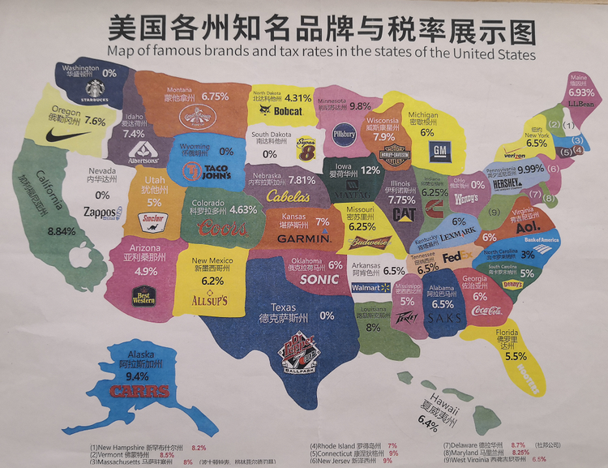

# 财税

本章以**资金**为主线，针对其不同表现形态以及由此涉及到的动作、组织、合规进行规范化说明。

* 资金形态：应收款、应付款、票据、增值税、企业所得税、房产税、社保、公积金等
* 资金操作：汇款、外汇、付款、缴税等
* 外部组织：银行、税务局、市场监督管理局、住建局、社保局等

## 资金形态

### 税

#### 中国

中国税务业务种类繁多，监管严格，涉及知识点如下：  

* 税种：营业税、企业所得税、个人所得税、房产税
* 税收优惠：高企税收优惠、研发加计扣除优惠、[跨境应税行为免税备案](http://www.chinatax.gov.cn/chinatax/n359/c2857149/content.html)
* 备案：银行账号备案、跨境业务合同备案
* 人员认证：企业的工作人员到税务局办理涉税事物，必须先对人员的身份进行备案。员工离职，公司需要把员工从办税员中删除。两种情况均需要到**桔洲税务分局大厅**办理变更。
* 报税任务：请见 [Company 项目 Issue](https://github.com/websoft9op/company)

#### 美国



* 税种：Franchise Tax 州政府税（加州为固定金额 $800/年，科州为利润的4.63%）、Corporation income tax 公司盈利税
* 盈利税税率：  
  ```
  毛利 0-$50,000 税率 15%
  毛利 $50,000-$75,000 税率 25%
  毛利 $75,000-$10,000,000 税率 34%
  毛利 $10,000,000 以上 税率 35%
  ```
* 报税周期：自然年或公司周年（我们目前采用此周期）
* 报税任务：请见 [Company 项目 Issue](https://github.com/websoft9op/company)

### 发票

#### 开票{#makeinvoice}

网久软件提供给客户两种发票类型来源：

* 普票：航天金税盘+[诺诺电子发票系统](https://fp.jss.com.cn/#/)自主开具发票
* 专票： [湖南省电子税务局](https://etax.hunan.chinatax.gov.cn/wsbs/) 在线申请纸质专票（申请后等待邮局的寄送）

> 目前国税提供了公共电子发票平台（需申请Ukey），但还未推广到我司

约束：

```
# 自主开票

* 每月发票数量上限：200 
* 每张发票金额上限：9999元

# 专票

* 开票内容：技术服务费
```

操作指引：

* 安装税盘：联系[诺诺客服](https://www.jss.com.cn/)
* 人员认证：实名制认证的办税员增加电子税务局子账号
* 领票：①电子税务局领用发票（包含发票验旧），待审核通过（如长期未审核，可拨打桔州税局电话提醒审核）。② 登录**税盘**将申请的发票拉取下来（又称之为写票）
* 自主开具普通：税盘-开票-等待发票同步发票到诺诺发票网站-关闭税盘
* 导出开票数据：税盘-报税处理-报税管理-发票数据导出
* 同步普通发票：开票后金税盘会自动同步到诺诺电子发票系统，但如果没有自动同步，需通过**诺诺客户端**手工同步。
* 下载普通发票：[诺诺发票网站](https://fp.jss.com.cn)-下载发票
* 发票存档：普通发票和专票均需要存到**企业微信网盘**永久保存，并便于给客户分享发票 URL
* 发票开错冲红：税盘-增值税电子普通发票填开-红字-开具销项负数发票
* 开具专票：电子税务局-开票-填写含税金额-填写抬头-确认开票-缴税-邮寄发票

客户争议解决：  

```
1. 到税务局代开的发票，客户验票出现“查无此票”的情况？
主要是某些代开网点没有及时上传发票的数据导致，出现此类情况需等待7-10个工作日再查

2. 金额低于800元，但申请的专票怎么办？
告之客户我们为小规模纳税人（区别于一般纳税人），默认开具普票。如果客户考虑税的问题，我司可以给客户补税款。如果客户仍不同意，我们将开具专票
```

#### 收票{#getinvoice}

收票即网久软件向供应商索取发票的操作，基本原则如下：

* 发票来源：外包项目、办公采购、福利差旅、云服务和软件、平台佣金等
* 项目类型的业务，先收票，再付款
* 电商交易的业务，自主索取发票（[需自主开具发票的清单](https://github.com/websoft9op/company/issues/96)）
* 金额超过1000元的发票[在线验证](https://inv-veri.chinatax.gov.cn/)
* 外协员工可以通过[电子税务局](https://etax.hunan.chinatax.gov.cn/wsbs/)以**自然人**的方式开具劳务发票（劳务费发票需单位代扣税，扣税比例接近10%）

客户需要我们提供开票信息时，直接复制下面的内容给客户：  

```
名称：长沙网久软件有限公司
纳税人识别号：91430104MA4L4B1F49
开票项：技术服务费
邮寄地址：湖南省长沙市岳麓区麻园路麓枫和苑4栋红枫基地701

目前为小规模纳税人，普票即可。

联系人：谭小姐（0731-82183159）
```

## 资金操作

### 平台结算

操作人员需要熟悉云平台的结算规则，并及时处理结算：  

**阿里云**   

```
抽佣：10%
发票：阿里云向我方提供发票
周期：每月1号至当月月底前一天为一个周期。
出账：每月5号自动更新上月预结算的账单明细。
到账：15日正式结算付款，付款时间可能会受节假日以及财务审批进度的影响
```

**华为云**   
```
抽佣：5%
发票：华为云向我司提供发票
周期：每自然月。
出账：每月3号出账单明细（如遇节假日则顺延至下一工作日）
到账：华为云发起付款流程（8个工作日） → 启动付款环节（6个工作日） → 到账
```

**腾讯云**   
```
抽佣：10%。
发票：
● 镜像抽佣：腾讯云向我方提供发票
● 镜像补贴：我方向腾讯云提供发票
● 渠道奖励：我方向腾讯云提供发票
开票资料：见客户成功系统
周期：每自然月
出账：次月月中前，10个工作日内/左右，可出账上月费用。
到账：收到发票后会在5个工作日内按序处理，结算流程20个工作日。
```

**AlibabaCloud**   
```
抽佣：20%
结算要求：
1.我司提供invoice，抬头须为Alibaba cloud (Singapore) pte Ltd；
2.我司提供Declaration letter，需带公司 LOGO
3.我司提供银行信息（可为国内银行）
周期：按季度结算
出账：在结算季次月下旬，将上季度费用明细发至我司 operation@websoft9.com 邮箱。
```


**Azure**   
```
抽佣：3%
周期：每自然月
出账：按月进行 (只要满足付款阈值) 。 通常会在次月的第 15 天之前发送信息。 
到账：付款通常需要额外 1 到 10 个工作日，以到达帐户。
```

**AWS**   
```
抽佣：20%
周期：每月9日-次月9日
出账：次月9日出支付报告（Disbursement Reports）。
到账：出报告后2-5天到达帐户。
```

### 对外汇款

* 中国对中国：仅限企业间汇款
* 中国对国外：中国公司对外汇款的流程比较复杂，【微盘】>【财税后勤】>【归档】中存放了交通银行外汇操作实践。
* 美国对中国：美国公司对中国汇款相对比较简单，不收任何约束，直接网银转账即可。

### 汇入结汇

交易编码：227020 - 计算机服务

**[长沙银行](http://cscb.cn/)在线结汇**：准备结汇资料 > 汇入汇款 > 填写表单以及上传资料

```
1. 合同或框架合同（复印件盖公章、骑缝章）
2. 结算单（匹配框架合同）
3. 邮件往来（截图打印盖公章）
4. 涉外收入申请表（原件，第二联需公司盖章）
5. 任务单（原件交银行，表头、表尾盖公章）
```

**[网商银行](https://mybank.cn)在线结汇**：准备结汇资料 > 国际业务 > 外汇收款  > 找到待申报款项 > 申报 > 填写表单以及上传资料

```
1. 合同（单笔5万美金以下）
```


## 外部组织

以下组织的联系人信息请见 CustomerSS 系统

### 政府单位

### 银行

### 合作伙伴

* 猪八戒财税：税务外包商


