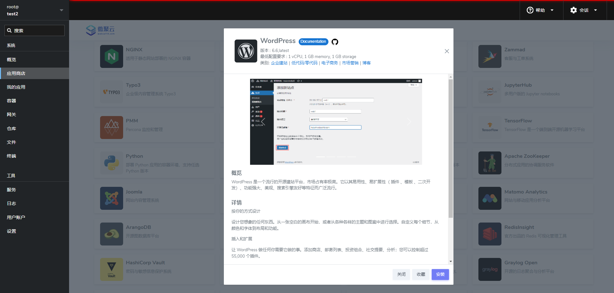
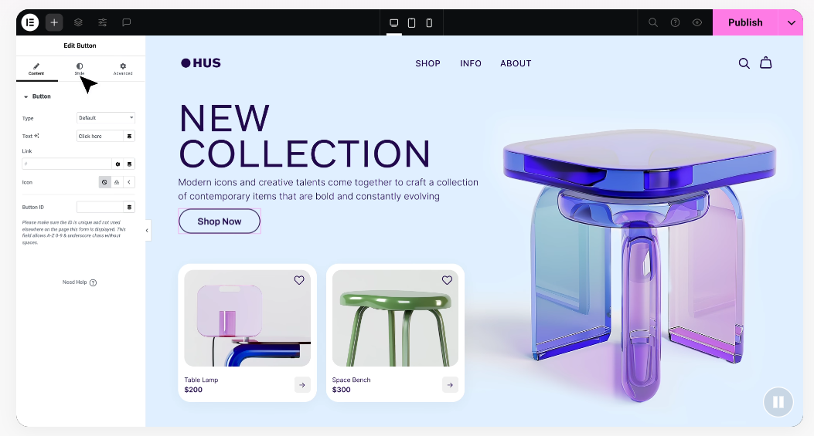

# 做官网怎样才能不花冤枉钱？Websoft9 告诉您真相

您想做官网吗？如何您经过慎重的评估和判断，断定官网对您没有价值，那么剩下的内容您就没有阅读的必要了。  

如果您对官网感兴趣，那么非常荣幸与您一起探讨学习

## 官网重要吗？

如果您仍然没有意思到官网有多重要，那想想您是不是经常遇到如下的困境？

- 客户反馈在网上搜索不到您的企业
- 企业发展多年，仍然只能做熟人生意
- 向客户介绍企业时，总是要通过 PPT 一对一的讲解
- 企业的知识库分散在核心员工的电脑中

一句话总结：**企业没有官网，客户就无法了解您企业的来龙去脉、生态定位、发展动态，也无法有效的获得企业提供的服务，那么企业就没有任何品牌可言。** 

## 想做官网却止步不前？

客户想做官网却迟迟没有行动，可能是由多种因素导致的：

### 对成本预算缺乏准确的判断

做一个官网可能涉及多项费用，包括域名购买、服务器租赁、网站设计、开发和维护等成本。   

客户可能对官网建设的成本不太清楚，存在误解。比如认为官网建设是一笔巨大的开支，而实际上，通过合理规划和选择合适的服务提供商，成本是可以控制在一定范围内的。这种对成本的不确定性使得他们不敢轻易启动项目。另外，客户可能担心无法承担这些费用，或者正在努力筹集足够的资金。

### 网站的建设目标不明确

客户可能还没有清晰的网站目标。他们知道需要一个官网，但不确定是主要用于品牌展示、产品销售、客户服务还是内容营销文章的分享等。例如，一家传统制造业企业想做官网，但是内部对于官网是重点展示生产工艺还是产品优势等目标没有达成共识，这就导致项目难以推进。

### 未准备好足够的内容

缺乏足够的内容是一个常见的原因。客户可能还没有准备好网站所需的文字、图片、视频等资料。例如，一个艺术设计类公司想要制作官网，但还没有完成艺术品的高清图片拍摄和详细的作品介绍文案，这就会推迟官网建设的进度。对内容质量要求较高也会使客户犹豫不决。他们希望网站内容能够精准地传达品牌形象和产品价值，因此在内容创作和审核上花费大量时间，确保内容符合品牌定位和营销目标。

### 时间和资源分配约束

针对于小型组织，高层必须亲自参与网站建设。客户可能忙于公司的日常运营和核心业务，没有足够的时间来关注官网建设项目。  

比如一家以项目为主的咨询公司，老板主要精力都放在打单与交付中，无暇顾及官网建设的细节。所以，如果没有专门的团队或人员来负责官网建设，客户可能会担心无法有效地管理和推进项目。  

### 技术选择的困惑

客户可能对网站建设技术不太了解，担心技术难度太大，自己无法掌控项目进程。例如，对于网站技术平台先进性、源码合规性、响应式设计、安全性、搜索引擎优化（SEO）等技术问题感到困惑，不知道如何确保网站的质量和性能。   

担心技术更新换代快，网站建设完成后很快就会过时。例如，随着移动互联网的发展，新的网页设计趋势和技术不断涌现，客户害怕投入大量资金建设的官网在短时间内就不符合市场需求。

### 供应商选择困难

市场上有众多的网站建设公司、设计师和开发者，客户可能在选择合适的供应商时感到迷茫。他们不知道如何评估供应商的专业能力、信誉和服务质量，担心选择不当会导致项目失败。  

曾经有过不愉快的网站建设经历，如遇到不专业的供应商、项目超支、延期交付或质量差等问题，这会让客户在再次启动官网建设项目时更加谨慎。  

分析上面关于企业（主要是小型组织）想做官网却一直没有做的根本原因，总结起来实际上就是两个因素：

- **缺钱**：资金不足则需要精打细算，由此产生的决策的困惑因素就比较多

- **缺人**：缺乏准备内容的人、缺乏评估项目的人、缺乏技术维护的人

## 如何不花一分冤枉钱？

Websoft9 从事网站应用托管有 20 年的经验，总结了一套面向中小组织的网站实践经验，它保证企业建网站时 **不多花一分冤枉钱** 。  

主要的实践流程如下：

### 网站成本预算透明化

网站的成本实际上由如下几个部分组成：

- **服务器成本**：服务器成本根据配置不同，大约 500-1000元/年

- **建站系统**：建站平台是用户创作网站、运行网站的软件系统。工欲善其事，必先利其器。Websoft9 推荐用户**选择 WordPress 作为免费的建站平台**。WordPress 是一个 全球 42% 的网页基于 WordPress 构建，它被用于 企业建站 低代码/零代码 电子商务 市场营销 博客 等场景。WordPress 是一个流行的开源建站平台，市场占有率极高。它以其易用性、易扩展性（ 插件 、模板 、二次开发）、功能强大、美观、搜索引擎友好等特征而广泛流行。

- **维护网站人工成本**：维护网站和处理网站故障中的技术成本支出。使用 Websoft9 托管平台管理 WordPress，每年的费用不超过 200 元的同时，可以获得 Websoft9 的技术支持，确保网站出现故障时，得到免费的支持。

- **交付网站人工成本**：策划、设计、实施交付。

- **推广网站人工成本**：网站的 SEO 策略以及广告推广。

交付网站与推广网站在实践中，小型组织往往是由客户自身主导、辅助外部资源协作完成，这样可以将成本降低到最低。

可见，建设一个网站的真正硬性支出就是：**服务器成本+技术维护成本，即最低可以为 700元/年。**

如果这个成本都无法接受，那么就偏离了基本的市场规律，完全是一厢情愿、不切实际的期望。  

### 让客户专注于内容创造

一旦选择了 WordPress 作为建站平台，用户就可以在**所见即所得**的方式下专注于内容创作：

#### 可视化编辑器

WordPress 的 Gutenberg 编辑器采用了块式编辑的方式，这种设计使得内容创作就像搭建积木一样直观。用户可以轻松地添加段落、标题、图片、列表等各种内容块，并且能够直接在编辑器中对每个块进行排版和样式设置。例如，用户想要插入一张图片，只需点击 “添加块” 按钮，选择 “图像” 块，然后上传或选择媒体库中的图片即可，无需复杂的代码操作。

#### 主题与模板

WordPress 拥有海量的主题，这些主题在设计上已经考虑到了内容展示的优先级。用户可以选择一个简洁、以内容为中心的主题，这些主题通常具有清晰的排版布局，能够突出文章标题、正文等内容元素。例如，许多新闻类主题会将文章标题和摘要放在显眼的位置，方便用户阅读。

#### 插件扩展

WordPress插件是能极大丰富和拓展WordPress功能的工具。它们种类繁多，涵盖内容创作与编辑（如Grammarly检查语法等错误、TinyMCE Advanced增强编辑功能）、搜索引擎优化（Yoast SEO和All in One SEO Pack助力关键词设置、内容分析和生成网站地图等）、安全防护（Wordfence Security扫描检测恶意软件和提供防火墙、iThemes Security加强多种安全防护）、社交媒体（Social Media Share Buttons添加分享按钮、Nextend Social Login实现社交账号登录）等各个方面，能满足不同用户在功能增强、安全保障、流量获取等多方面的需求，让用户能更灵活、高效地运营WordPress网站。

###  充分使用外包人力资源

在制作 WordPress 网站时，充分利用外包资源可以有效提升网站的质量和开发效率。以下是一些具体的方法：

#### 设计外包

可以通过在线设计平台、自由职业者网站（如 Upwork、Freelancer 等）或者向同行咨询来寻找有经验的 WordPress 网站设计师。这些专业人士能够根据您的品牌形象、目标受众和业务需求，提供定制化的网站设计方案。例如，对于一个高端时尚品牌的 WordPress 网站，专业设计师可以设计出富有现代感和时尚气息的页面布局，包括独特的色彩搭配、精美的字体设计和吸引人的视觉元素。  

在与外包设计师沟通时，要清晰地传达网站的设计理念、功能需求和风格偏好。可以收集一些自己喜欢的网站案例作为参考，向设计师展示您期望的网站布局、色彩方案、交互效果等。例如，如果您希望网站具有简洁明了的导航栏和突出的产品展示区域，就需要明确地告知设计师。同时，也要考虑到 WordPress 的特点和限制，确保设计方案在技术上是可行的，能够通过主题和插件来实现。  

#### 实施外包

设计完成后，就减少了大量不确定的工作。将设计作品网页化即网站实施，它是一个相对比较高效率的实施交付工作。  

#### 开发外包

详细列出网站开发的任务清单，包括页面模板开发、插件集成、功能定制（如用户注册 / 登录系统、评论系统、搜索功能等）、数据库设计等。对于每个任务，要明确技术要求和预期的功能实现方式。例如，如果需要集成一个特定的第三方支付插件，要向外包开发者提供插件的详细信息、支付流程要求以及与网站其他功能的交互方式。

#### 维护外包

前面提到了使用 Websoft9 托管平台维护网站，可以实现较低的成本下获得技术保障服务，这是一个不错的选择。Websoft9（微聚云）是一个企业级的多应用托管平台，旨在让任何人都能轻松地在自己的基础设施中部署和管理软件。Websoft9 资深 WordPress 专家服务，为内容营销业务保驾护航。

## 总结与展望

当客户先将注意力聚焦于所使用的工具，并真正理解了拆分项目这一关键环节时，神奇的事情便会发生。   

就像在网站建设的旅程中点亮了一盏盏明灯，成本不再是令人头疼的难题，它会被压缩至最低限度。每一分钱都花在刀刃上，没有丝毫的浪费。同时，效率如同插上了翅膀，各个环节紧密衔接，快速推进，不再有拖沓与延误。而最终呈现在眼前的网站效果更是令人惊叹，无论是页面的美观度、功能的完善性还是用户体验的友好度，都能得到极大的提升，仿佛每一个细节都被赋予了生命，熠熠生辉。这便是专注与理解所带来的强大力量，让网站建设的过程成为一次精彩的蜕变。

千里之行始于自己！

