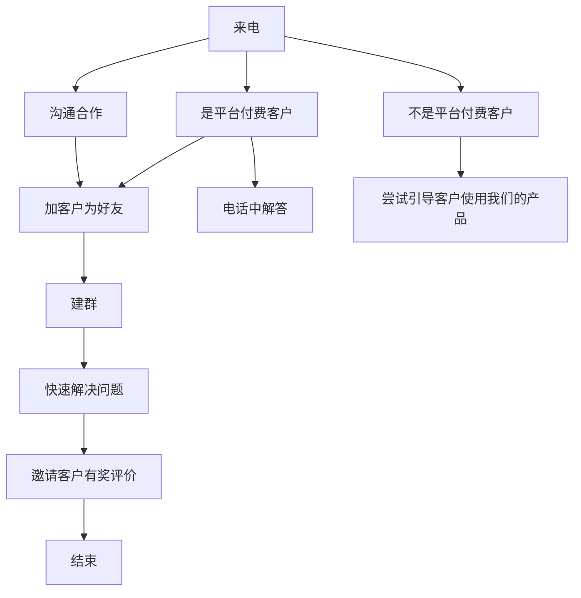
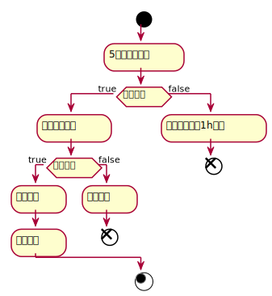

import DocCardList from '@theme/DocCardList';
import {useCurrentSidebarCategory} from '@docusaurus/theme-common';


# 客户成功

客户成功大体相当于客服工作，“客服”显得很被动，而客户成功是一种主动行为，是从用户视角的存在意义变更，从而使得其价值更大。

客户成功是一个辩证统一的工作，即让客户得到超出期望的回报的同时，公司的回报就自然发生。  

客户成功在微观上是指通过与客户建立一个“一对一”连接后，再进行有效率的沟通，实现双方的沟通目标，目标完成后释放连接。

## 做什么？

### 关心客户

自始至终关心客户，真诚的为客户着想，是这个团队存在的首要价值：

* 始终假设您是负责确保客户成功的人。
* 在支持客户时，任何问题、事件或损失都是 Websoft9 的损失
   - 当客户遇到麻烦或停机时，请像 Websoft9 遇到停机时一样紧急采取行动。
   - 当客户失去生产力时，请以与 Websoft9 失去生产力相同的紧迫感采取行动。
   - 客户系统上的应用可能影响到成千上万个用户，其紧迫性与 Websoft9 每天损失 100万 相同。
   - 无论他们付给我们多少钱，这种待遇都是平等的。
* 问题得不到有效解决时，需尽快升级，哪怕让 CEO 参与进来也在所不惜，尽早为客户提供所需的所有资源。
* 不仅关系具体的问题，同时也要关心问题可能给客户带来的岗位或业绩的损失

请记住，作为客户成功的成员，当某人遇到问题或疑问时，我们是第一个与他们互动的人。因此，我们有责任代表公司并确保我们正确展示自己。因此，我们应：

* 始终保持友好和尊重
* 对新想法和观点持开放态度
* 自己不知道的，可以随时询问其他人再向客户解释，不要显得知识过于单薄
* 有必要的拒绝，需尽可能委婉（但尝试建议解决方法，并在必要时升级到高级）

### 在 Websoft9 的职责

客户成功集成了**工程和销售**两个部门职责，工作具有立体性，更需要多面手：

* 了解产品以及根据产品文档直接解决客户问题
* 善于让研发工程师参与到复杂问题中，努力推动解决问题，体现极高的客服困难的素养
* 总结用户需求并反馈至产品团队（扩大客户的声音）
* 在提供良好用户体验的同时，考虑支持成本
* 优秀的应用架构能力，有能力为客户提供较为合适的多产品组合方案，让客户明确技术实践路线

### 为客户提供哪些价值？

创业早期，Websoft9 采用**产品收费+人工免费**的模式，在运营将近 1 年后，发现难以为继。后面复盘反思的时候，我们越发坚信：理性的企业客户对**降本增效**具有天然需求，并愿意为此付费以获得优秀的产品和服务。  

实际上，Websoft9 为客户提供了一些看得见的价值：  

1. **及时性：**及时性指发布的第一时间就可以获得，现实中看电影、火车站的VIP等。对于 Websoft9 来说，及时性就是最新版本。
2. **个性化：**个性化即特别，即满足用户的个性化需求。对于 Websoft9 来说，可以通过服务和交付满足用户需求至关重要。
3. **解释性：** 产品文档就是最好的解释性，没有产品问题，客户就无法很方便的使用和维护。
4. **可靠性：**产品可靠，质量稳定
5. **易取性：**订阅即使用，删除即停止付费
6. **实体化：**在线人工客服、直播以及线下交流会都是实体化的象征
7. **可参与：**开源软件的用户参与研发，用户赞助都是一种极好的体验
8. **可寻性：**寻找选型是极其关键但难度非常大的事情。对于 Websoft9 来说，我们让客户很方便的找到用应用是重要的价值体现。

站在用户使用软件的生命周期来看，我们在各个阶段提供的价值，就能够获得用户的拥护。  


## 接触点指南

多个客户接触方式，组合使用：  

##### 电话

首选沟通方式，以便可以快速了解用户需求。
目前所有外部来电首先会直拨（或转接）到0731-82183159。





##### 邮箱

help@websoft9.com

##### 聊天

采用企业微信中的：在线客服（免加好友）、群聊和加好友一对一沟通等三种方式。  

群聊中 Websoft9 最少有三个参与角色：Owner，技术工程师，商务专员

群聊命名规范：

- 面型客户：××公司专属服务群-Websoft9
- 面型客户：××公司合作群-Websoft9


##### 工单

Websoft9 客户成功系统工单和阿里云工单。

收到工单之后，如果不是明确的问题，请**立即**电话联系客户：  

1. 电话中充分了解客户问题
2. 使用企业微信加客户为好友，并将客户信息录入到 CustomerSS 系统
3. 通过企业微信解决客户问题

##### 在线调研

通过客户成功系统发起针对性的调用

##### 产品群聊

通过专属的产品群聊，了解用户需求

## 让问题增值

### 问题协作

客户成功团队为主要用户沟通界面，及时、高效和热情的响应客户需求。技术部门同事作为后台技术支持，处理运营部门无法独自解决的技术故障和难题。  

16字方针：“运营主导，技术支撑，疑难会诊，文档总结”

### 问题扩大化

问题扩大化是一个诙谐的表达，其本质是需要让 Websoft9 更多的人可以看到问题，并在解决问题的时候贡献自己的智慧。

### 记录问题

记录问题，可非常有效的改善产品和体验。  

每一个来自客户的**有价值问题**，首先需要在系统中提交 Issue

* GitHub Issue
* CustomerSS Issue 


## 沟通场景 

| **场景** | **问题**                                                     | **核心要点**                   | **主动方** |
| -------- | ------------------------------------------------------------ | ------------------------------ | ---------- |
| 宣传     | 将产品服务信息传递给指定的客户，例如：博客、群发，邮件推送，电话沟通 | 云中立、内容严谨、效果明显     | Websoft9   |
| 寻找     | 客户通过商品目录，找到符合需求的潜在应用                     | 场景化的商品分类和展现方式     | 客户       |
| 试用     | 试用产品，获得直接的认知                                     | 试用成本极低或免费             | 双方均可       |
| 购买   | 客户提出需求（可能非常笼统），Websoft9 速获取客户的真实需求，并在语言体系上达成一致，最终落实到具体的产品上 | 礼貌、语言体系一致性、谨慎推荐 | 双方均可      |
| 实施     | 个性化需求的实施或定制                                       | 配置实现，减少开发             | 双方均可       |
| 生产使用 | 产品稳定运行，技术故障可获得支持                             | 产品稳定，支持到位             | 双方均可       |
| 软件维护 | 技术故障处理或技术指引、升级                                 | 技术支持能力和产品的可维护性   | Websoft9       |
| 使用回访 | 我方主动关怀客户，包括：调研，具体工单处理结果回访           | 能够提出对客户有价值的问题     | Websoft9       |
| 终止     | 客户提出订阅终止                                             | 能够收集客户离开的原因         | 双方均可       |

### 售前

* 快速答疑
* 提供合同
* 提供报价
* 出具方案
* 演示试用

### 售后

##### 在线培训
##### 商务支持
##### 技术支持
##### 评价管理：云平台评价[参考](https://support.websoft9.com/docs/order)指南
##### 关联账号

##### 回访调研

* 商品：商品指的是云市场上发布的商品，本类调研注重对商品搜索、商品分类、商品详情页等
* 产品：产品指的是客户使用的镜像，本类调查注重对产品安装、产品配置、产品稳定性、产品功能等
* 文档：文档指的是我们产品配套的文档，本类调查注重对文档格式、语言表达、专业知识等
* 服务：服务指的是客户主动的沟通，本类调查注重对服务获取、响应时间、获取渠道、解决效率、客服态度等

### 客服模式化

#### 简单问题

可以通过快速对话就可以解决的问题，我们称之为简单问题。下面是简单问题快速沟通示例：

```
客户：在吗？
你：请问需要什么帮助？

客户：数据库密码是什么？
你：请问您使用了我们什么镜像产品？是哪个云呢？
客户：腾讯云上的LAMP
你：默认数据库密码是123456，详情请参考我们的相关文档...

客户：我出现了网站无法访问的情况？
你：请问您使用了我们什么镜像产品？是哪个云呢？
客户：阿里云wordpress
你：请发送一个商品截图以便我诊断
```

#### 不可解释问题

有一种问题，本身不难，但是很难以通过沟通去解决。这个时候，就要学会使用产品文档

| 客户提问        | 回答                           | 注意                 |
| --------------- | ------------------------------ | -------------------- |
| Linux怎么登录？ | 使用WinSCP登录，参考文档       | 不能去一步一步教客户 |
| HTTP连不上？    | 安全组80端口没有打开，参考文档 | 不能去一步一步教客户 |
| 怎么更换镜像？  | 通过服务器控制台更换，参考文档 |                      |


#### 暂无方案问题

对于有义务为客户提供解决方案的沟通，如果没有已有文档，但在一对一沟通中很费时间又不容易说清楚的情况下，如何处理？

```
客户：请问Seafile怎么设置HTTPS
你：您好，针对这个软件目前我们还没有精准的HTTPS方案，我们需要整理并测试后才能给您，可以吗？
```

#### 故障问题

【故障】是一个比较特殊的词语，在这里我们针对故障做出特殊说明：任何人都不希望故障的出现，故障的发生也必定引起用户的焦虑和不满，但是故障是不可避免的，故障的责任是需要区分的，故障的处理也是分为免费和收费的。



故障问题需要快速鉴定，“5分钟诊断故障”是一个黄金时间，时间太短客户心理没底，时间太长客户认为你不专业。故障的鉴定一定要准确，有理有据。

**举例：**客户使用了SQLServer镜像，这两天突然磁盘满了导致系统无法访问。

**诊断：**经过查询数据库文件（路径：C/...），发现数据库文件总大小已经达到17G，导致系统盘已经没有任何空间。我们知道操作系统是需要缓存的，系统盘满会导致操作系统运行不正常。可见，此问题非软件故障，是一种特定场景下的突发问题。

**建议的方案：**将数据库文件迁移到数据盘（同时提供迁移方案）。如果您没有时间或受限于技术能力导致无法自行实现此方案，请购买我们的人工服务代劳。


##### 礼品赠送

## 沟通效率

客户成功过程需有效的沟通。沟通就要用到合适的沟通语言，杜绝高冷傲娇的姿态，用心让客户感到来自 Websoft9 的尊重。   

Websoft9 客户成功团队需要对 Support 文档进行反复研读，掌握基本的[词汇](https://support.websoft9.com/docs/user/glossary)，表现出良好的专业素养。  

### 礼貌用语

比较礼貌的沟通方式：

- 您好
- 您还在吗？
- 还有什么可以帮助到您的？
- 我可以关闭这个工单了吗？
- 这个问题解决了吗？
- 这个我目前没有遇到过，不知道怎么处理呢
- 这个不属于支持范围哦
- 嗯

不礼貌的沟通方式：

- 只有符号没有文字，例如：？？ 
- 生硬的响应方式，例如：客户问问题，你直接发一个文档链接但不加任何解释
- 与客户争吵
- 爆粗口

### 信息确认

客户在传递问题的时候，受制于其语言体系和表达习惯，让客户成功团队理解起来会比较苦难。  
此时，学会在沟通中不断的进行**信息确认*是一个非常重要的技巧。

举例：客户说自己在阿里云上买了我们一个服务。  
这个时候，Websoft9 必须先想客户明确，是不是买的一个交付方式为镜像的软件包。


### 8 大技巧

以下8大技巧，对提升沟通效率非常有帮助

##### 轻重缓急

客户来沟通，需要针对客服的问题，做一个优先级排序，轻重缓急的安排下面，一个一个解决，不可胡子眉毛一巴抓

优先级排序：紧急故障>初次使用>普通故障>售前咨询>自主配置

##### 肯定语气

尽量使用肯定语气向客户索要解决问题所需的准备要素，让客户无需有决策时间。

正确举例：请将您的服务器IP和密码发给我，这样我才可以去诊断日志，更方便快速的解决问题
错误举例：可否将您的服务器IP和密码发给我？

##### 不忘邀功

如果我们打算采用免费给付费客户提供一项服务，一定要先声明此项服务本来是收费的，但是出于*****原因，我们可以给客户免费的做一次。

##### 及时关闭

帮助客户解决了问题或完成了一个沟通，一定要记得临时关闭这个沟通。就像系统一样，不要保持太多的并发连接。

##### 过滤筛选

如果一个问题需要调动工程师处理，请客服人员通过沟通，准备好工程师所需的诊断问题条件，包括：

* 云平台
* 产品名称
* 故障概要&截图
* 购买时间
* 是否改动
* 云服务器账号（客服人员先测试客户提供的账号是否可用）

##### 知识库化

碰到的问题，归类到产品中，便于后续追溯

##### 客户参与

如果客户乐意，可以让客户在Github上提交Issue，甚至提供方案，我们再合并到项目中

##### 授人以渔

通过远程桌面，教会客户处理简单问题，授人以鱼不如授人以渔


