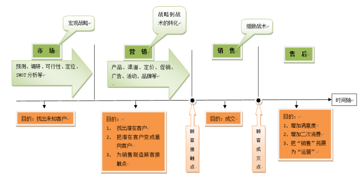

import DocCardList from '@theme/DocCardList';
import {useCurrentSidebarCategory} from '@docusaurus/theme-common';

# 销售

## 做什么？

在了解销售部门职责的时候，我们先通过下图理解市场营销与销售的关系：

管理大师德鲁克指出，企业的目标是创造客户，因此企业有两个并且只有两个基本功能：市场营销和创新。

市场营销是关于企业如何发现、创造和交付价值以满足一定目标市场的需求，同时获取利润的学科，涵盖以下业务：

* 市场是获取关注，吸引陌生用户了解到产品。和还不了解产品的人打交道。
* 销售是为了转化已经了解产品的用户，变成付费用户。和有意向买产品的人打交道。
* 运营是使用户持续使用产品，并产生更多信任和好感，持续变现。多半和已经使用产品的人打交道。

销售过程两大核心模块：

- 辨识客户的决策机制，发现需求
  辨识对方的决策机制就要求我们要有强大的倾听能力，观察能力，洞察能力，感知能力，换位思考，同理心以及我们自身的社会经验和专业认知等，通过辨识，发现真实需求
- 高效施加影响力，交付价值
  高效施加影响力就要求我们有强大的信任获取，说服，引导，沟通，暗示，讲故事，试探，推动，氛围的营造等能力，最终能达成售卖。

Websoft9 的软件产品在云市场的销售：

- 通过电话沟通让客户购买我们的软件产品和解决方案，为客户创造价值
- 与客户保持长久互信的关系
- 通过品牌、产品、行为等影响力让关系持续变现

## 怎么做？

### 联系客户

获取客户的联系方式，记录到系统中。

与客户进行沟通时候所需的技巧：

* 把客户当熟人（热情）
* 提问题并积极聆听（充分理解客户）
* 站在对方的角度看问题（同理心）
* 表达真实具体的内容（不玩虚的）
* 牢记公司的接口人角色（不是一个人在战斗）

### 了解客户

通过现象去了解本质，挖出客户信息与真实想法，比如客户是什么企业、联系人是什么角色和性格特点，客户的需求、兴趣点、关注点、客户的预期、疑虑、积极因素和消极因素（ 不愿意成交的原因 ）是什么。

### 价值销售

