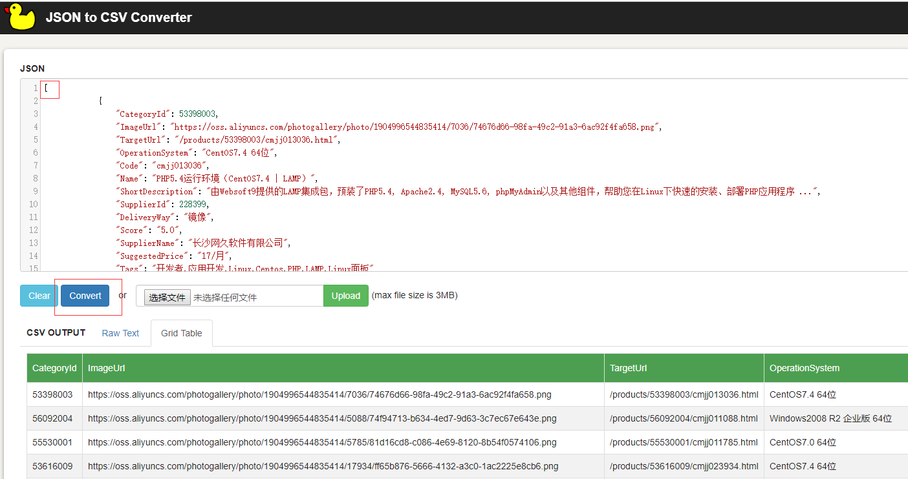

# 阿里云

## 常用范例

### 查询并导出商品

1. 打开 [API 调试器](https://next.api.aliyun.com/api/Market/2015-11-01/DescribeProducts?lang=JAVA)
2. SearchTerm 填写“长沙网久软件有限公司。筛选项：key=productType, vaule=MIRROR；
3. 导出数据：复制 Json 内容到 [Jason转Excel](https://jsontoexcel.com/) 工具中导出

    ```
   [

   { 第一个商品  },
   { 第二个商品  },

   { 第n个商品  },
   { 最后一个商品}

   ]
   ```
    