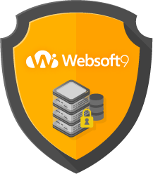

# 安全

网络安全是云计算中的重要关注焦点，忽略网络安全，必定会受到深刻的教训和惩罚。Websoft9在镜像选型、生产（自动化安装）、发布审核、维护更新整个过程中，都非常关注安全问题。

## 软件选型

选型是我们安全工作的起点，决定产品的安全走向。针对镜像中的开源软件选型，需要把握如下安全原则

1. 不使用已经停止维护的开源软件，比如PHP 5.2、5.3、5.4、5.6系列，Mysql 5.1系列 、Tomcat6系列等
2. 只要被一个云平台列为“不安全黑名单”的开源软件，不再发布到其他云平台。例如：dedeCMS 被阿里云列入不安全名单，那么在华为云就不再尝试上架
3. 所选开源软件不得含有任何形式的木马、挖矿、后门、蠕虫、病毒、恶意代码、未知功能及未知权限
4. 所选开源软件产品中不得含有可能收集、侵犯个人隐私的功能
5. 所选开源软件的官方必须提供安装源、安装手册和更新说明
6. 所选开软软件若有采集或转移用户数据的功能，须要提供说明，并提供关闭此功能的方法
7. 不允许使用任何盗版或者破解版程序

## 镜像生产

我们所定义的镜像生产指：**产品自动化脚本编写、服务器上运行脚本安装开源组件、服务器打包成镜像文件**的过程。

#### 脚本编写安全事项

1. 每一个镜像产品都必须实现自动化脚本编写，并开源后托管到Github上，让用户可以通过脚本的源码完全了解镜像中的组件，组件的安装方式，以及做了哪些配置
2. 每一个组件尽量采用基于官方提供的源安装（官方提供的下载页面下载最新稳定版本进行安装），保证可以自动升级补丁或提供简单易懂的补丁升级方法，禁止通过非官方站点下载部署
3. 文件夹和文件权限尽量不高于750,640，禁止777权限
4. 不使用弱密码，数据库密码采用不低于8位的随机密码，保证每个用户具有唯一密码
5. 产品每一个组件的必须含有日志文件，不得删除日志，不得隐藏日志功能

#### Web安全

1. 设置合理的目录文件权限，防止未授权跨目录访问，比如.git/.svn等目录
2. 禁用HTTP目录索引
3. 默认关闭组件或程序调试模式，避免敏感信息泄露

#### OS安全

1. 用于制做镜像的服务器，必须是基于云平台提供的公共镜像来创建的虚拟机。但不允许使用停止维护的发行版本，如Debian6、CentOS4、Win2003
2. 设置操作系统补丁自动升级，并提供关闭自动升级的方式
3. 用于制做镜像的服务器管理员账号，必须采用32位的数字+字母+特殊字符密码
4. 默认日志服务保证正常运行，如：dmesg、syslog、wtmp、btmp、sudo等
5. 设置合理的防火墙策略，关注高危端口，屏蔽不安全的端口（如redis 6379、mongodb27017等），仅开放需要的端口（比如HTTP 80、SSH 20、RDP 3389、HTTPS 443等；
6. 环境配置中，不得更改云厂商默认的操作系统配置，不得删除云平台提供的操作系统中的安全Agent或其他组件

#### 打包安全

1. 镜像打包前，针对操作系统进行 generalize 操作。Windows运行：syspre，Linux根据发行版和云平台要求而定
2. 镜像打包前，初始化ssh配置文件

## 镜像发布

镜像在打包完成后，就会提交给云平台，平台一般会将镜像拉入到中心库进行安全扫描。

1. 根据云平台安全扫描反馈，进行修正。常见的安全反馈包括：操作系统补丁未更新、开启端口过多、文件权限、组件版本过低等
2. 在文档中必须标明已经开启的端口及其用途，用户需有开启或关闭端口的权限，用法需要向用户说明
3. 在文档中对弱密码进行强提示
4. 在文档中提供操作系统、开源组件的升级方案
5. 在文档中提供自动升级的关闭或开启方案
6. 在文档中提供商品的安全日志

## 镜像更新

镜像作为一种商品，需要持续更新。什么时候更新？怎样更新？

1. 镜像中的核心软件有重大安全漏洞，又无法指导用户通过在线升级的方案进行升级的情况下，需要重新制作打包镜像，上架
2. 镜像中的核心软件在产品功能和用户体验上，有重大改进，需要重新制作打包镜像，上架
3. 更新镜像与第一次制作镜像的流程是一样的，相当于重做镜像
4. 更新的镜像必须采用云平台官方最新的操作系统

## 技术服务

用户是使用过程中若有涉及到登录客户服务器的技术支持，需要遵循如下原则

1. 在提供人工服务（安装、调试、升级、维护、故障处理等）应遵守国家相关法律法规
2. 双方遵从买卖约定，涉及到对数据进行的操作，应该在得到客户的指令后方可开始
3. 不得破坏客户的网络，不得窃取客户的数据，不得保留客户的密码，不得嵌入非法代码（后门、病毒等）
4. 服务完成之后，通知客户更改关键密码
5. 未经授权，不得登录用户系统
6. 在服务过程中获悉的客户数据应该严格保密
7. 升级补丁升级，需用户方提供（或建议用户）从正规的渠道获取
8. 未经用户需求，不得提供指定服务之外的任何服务
9. 服务人员确保服务过程中使用的电脑不含有非法软件或病毒

------

## 附：安全体系建设

1. 建立健全的安全保障体系，定期检测（自动检测）产品的安全
2. 建立安全应急响应机制，对安全问题（漏洞）的解决方案，应该及时通知用户，包括：邮件、用户QQ群、客服QQ签名、文档、官网
3. 对员工进行安全培训，签署安全协议，日常考核安全遵循情况
4. 建立自动化的安全测试体系，根据安全规范，生成测试报告（有待实现）