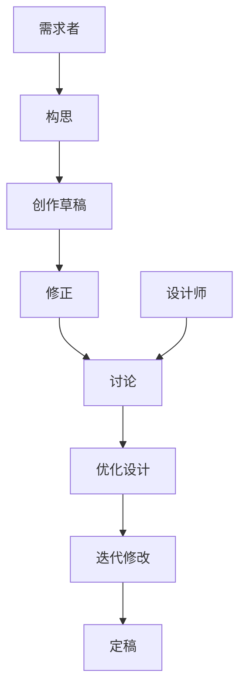

# 设计与交付

设计也是一门技术，而且是对综合知识要求极高的技术。 

设计技术的本质：单元化组件的组合。 技术最好由三层结构实现。  

* 单元化组件：单元化组件是可以被图片引用，并无需任何更改即可使用的设计元素。 例如 字体、颜色、矢量图标、插画、照片等
* 盒子化中间件：具有一定的“盒子化”特征，单元的设计具有整体性，不可被分割，但又比最小单元展示出更多的内涵
* 整体系统：网页、画册、场景化图片

## 设计架构师

如果我们准备在设计上提升能力，那么必须有一个设计架构师的角色。  

之所以称之为架构师，是因为需要这个角色能够对设计进行系统化设计，包括：

1. 设计工作整体规划
2. 设计建模
3. 业务流程规范化
4. 单元化组件制作
5. 设计工具选型
6. 设计风向与迭代

当前，我们继续解决的问题包括：

1. 设计工具选型
2. 单元化组件制作

## 协作流程

在设计中采用专业协作、多人分工的工作流程。

设计工作中主要有两种角色：

●需求方
●设计师

需求方即设计工作的发起者、收益者，例如：产品经理、营销经理等。

设计师是具备专业美术素养的设计技术人员

常见的工作流程如下：

最核心的原则：

1. 需求方自行在设计工具上创作一个草图，同时编写设计需求
2. 设计师在需求方的工作成果基础上进行进一步创作