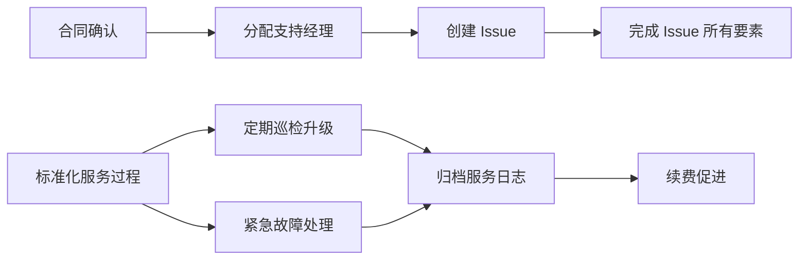
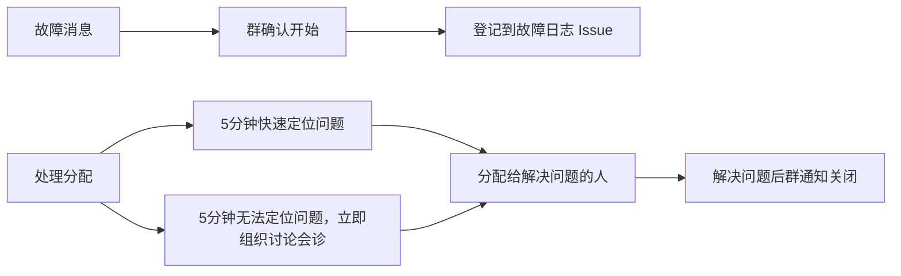
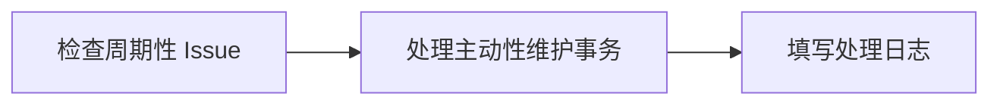

import DocCardList from '@theme/DocCardList';
import {useCurrentSidebarCategory} from '@docusaurus/theme-common';

# 专业服务 

[Websoft9 专业服务](https://www.websoft9.com/services/)又称之为产品增值服务，其与客户成功的区别在于：它是建立在企业已有产品和技术体系之上，结合第三方产品，给客户提供的一种可选的、收费的、个性化的服务。  

## 做什么？

在解释这个问题之前，先总结 Websoft9 具备的优势能力：  

* 软件云化部署与维护能力
* 软件之间的连接与集成能力
* 云市场销售通道能力
* 云资源的应用与架构能力
* 软件类目咨询能力
* toB 内容营销能力

所以，我们专业服务销售的就是这些能力。当时，这些能力不便于直接销售，它需要载体。  

载体就是客户需要的一种或多种专业级产品，Websoft9 优势能力 + 第三方专业级产品便组成了可售卖的专业服务或解决方案。

举例：

* WordPress 运维服务 = WordPress + Websoft9 软件云化部署与维护能力
* GitLab DevOps 开发服务= GitLab + Websoft9 软件之间的连接与集成能力
* 明道私有云分发服务 = Mingdao + Websoft9 云市场销售通道
* DevOps 解决方案 = GitLab + Jenkins + Websoft9 软件之间的连接与集成能力
* 内容营销解决方案 = WordPress+ Matomo + SendGrid + Websoft9 软件之间的连接与集成能力

总结：将自身的具优势竞争优势的核心能力与优势的产品进行结对，便产生了具备优势的服务，同时也将别人的产品销售出去。  

## 增值产品类目

Websoft9 主要的增值产品或解决方案包括：

* 云资源：有云市场合作的云平台
* ISV：WordPress, GitLab 极狐，Odoo, ONLYOFFICE 等，具体查看：企业微盘-> 市场与销售
* 解决方案商：赋能或被集成到解决方案商的业务中，一起服务于他们的客户

## 流程

### 包年服务

对于这种客户需要采用商务主管+项目经理的资源组合配置。流程如下：

#### 接入流程

#### 故障分配

#### 主动性维护

部分客户需要定期执行主动维护事务

